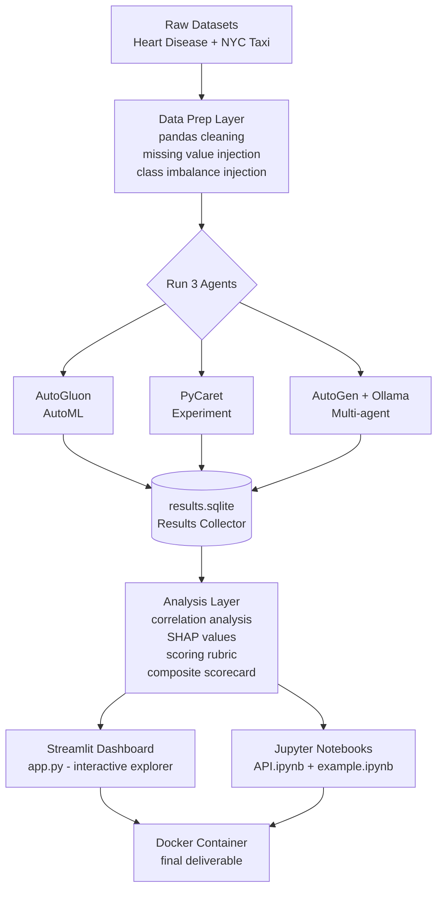
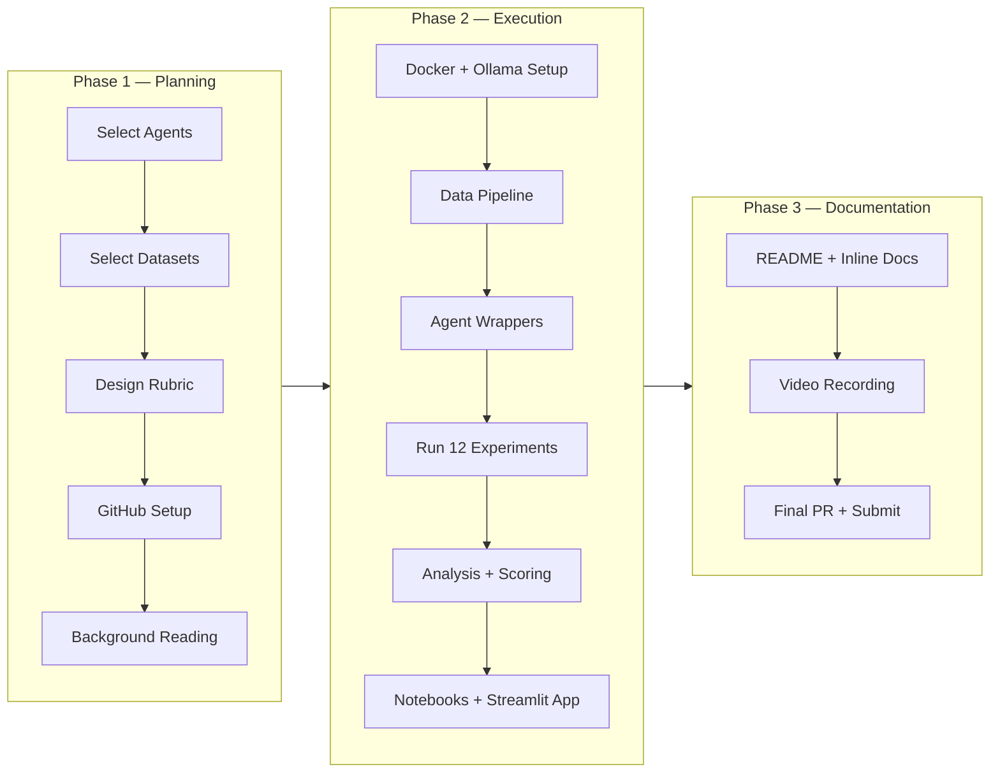
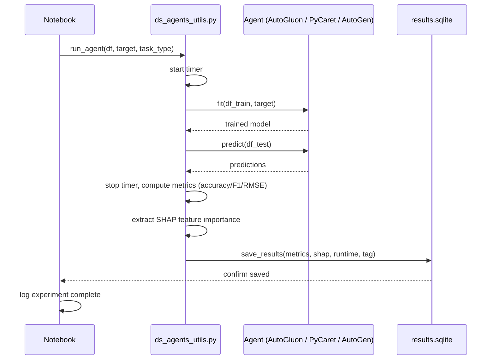
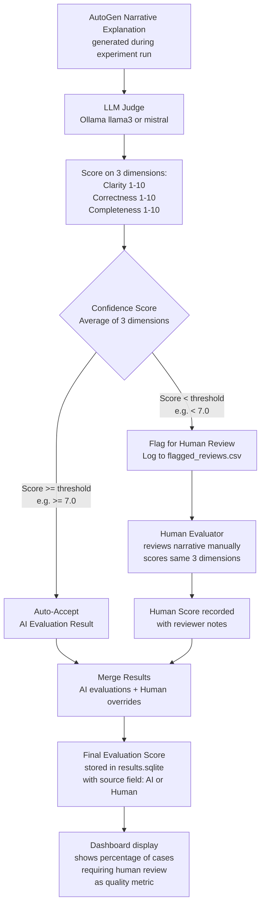
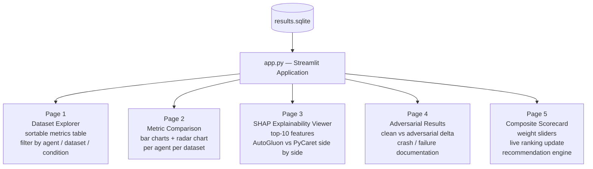

# Project Planning: Comparison of Data Science Agents
## DATA605 — Spring 2026 | University of Maryland MSDS

---

> **How to use this document:** This is the single source of truth for your project planning. Every section below was designed to be actioned directly. Check off tasks as you complete them. Share with teammates via GitHub — this file renders Mermaid diagrams natively on GitHub, making it fully collaborative and visually complete.

---

## 1. Project Overview

**Project Title:** `Comparison_of_Data_Science_Agents`
**GitHub Tag:** `Spring2026_Comparison_of_Data_Science_Agents`
**Type:** Research Project + Interactive Dashboard
**Effort:** ~40 hours (6–8 full working days)
**Format:** "Learn X in 60 minutes" tutorial style
**Primary Deliverables:** `ds_agents.API.ipynb` + `ds_agents.example.ipynb` + `ds_agents_utils.py` + `app.py` (Streamlit) + `README.md` + video

**The Core Question:**
> *Which data science agents produce the best models, most readable code, and most useful insights — and under what conditions does each one fail?*

**Why this project was selected over alternatives:**
This project was chosen because it combines all three of the student's technical comfort areas: local LLMs via Ollama, ML modeling with tabular data, and data analysis with pandas. It has the highest technical depth ceiling of all options considered. The addition of an interactive Streamlit dashboard further elevates it into the "Build X using Y" category on top of the core research project.

**Backup project:** Kafka Streaming Pipeline (recommended for its breadth across data engineering and its differentiation from the primary project's ML focus).

---

## 2. Agent Selection Strategy

You must benchmark **at least 3 agents** from different categories. Based on the free-only constraint, Docker compatibility, and the goal of deep technical learning, the recommended selection is:

| Agent | Category | Why Pick It | Free? | Local? |
|---|---|---|---|---|
| **AutoGluon** | AutoML | Best-in-class tabular ML, pip installable, no API key needed, supports both classification and regression | ✅ | ✅ |
| **PyCaret** | Experiment / AutoML | Low-code, fast, produces outstanding comparison tables across many ML algorithms in a single call | ✅ | ✅ |
| **AutoGen + Ollama** | Multi-agent framework | Multiple AI agents collaborate with each other using a locally-hosted LLM; the "going deep" technical angle for this project | ✅ | ✅ |
| **PandasAI** *(optional 4th)* | Natural language data analysis | Natural language interface for querying DataFrames; can run fully locally with an Ollama backend | ✅ | ✅ |

### Why NOT the others?

The following agents were considered and explicitly rejected for the reasons listed:

- **Devin** → Paid and commercial; not accessible without a subscription
- **ChatGPT Advanced Data Analysis** → Requires an OpenAI paid account; not reproducible by classmates
- **Open Interpreter** → Unstable Docker support; high risk of environment failures during demo
- **Jupyter AI** → Requires an API key for any meaningful use; adds cost or workaround complexity
- **CrewAI** → Architecturally overlaps with AutoGen; redundant to include both in the same benchmark
- **LangGraph** → Excellent tool but better suited as the foundation of its own standalone project

### The AutoGen + Ollama Angle (Why This Makes the Project Special)

Running AutoGen with a local Ollama model (e.g., `llama3`, `mistral`) keeps the entire project free and adds genuine technical complexity that most student projects lack. You are orchestrating multiple AI agents — an `AssistantAgent` and a `UserProxyAgent` — that pass messages to each other using a locally-hosted language model with zero external API calls. This is a meaningful, publishable-quality system design that demonstrates real understanding of multi-agent frameworks.

The key configuration: AutoGen's `OllamaWrapper` (or `config_list` with `base_url` pointing to `http://host.docker.internal:11434`) routes all LLM calls to the Ollama process running on your host machine, accessible from inside the Docker container via the bridge network.

---

## 3. Dataset Selection

Use **2 datasets** (quality over quantity — two well-chosen datasets within 40 hours is better than four shallow ones):

### Dataset 1: Heart Disease (UCI / Kaggle)

- **Task type:** Binary classification (predict presence or absence of heart disease)
- **Size:** ~303 rows, 14 features (age, sex, cholesterol, chest pain type, etc.)
- **Why choose it:** Small and fast to run — every agent can finish in seconds. The domain is well-understood. It is perfect for comparing model accuracy, feature importance, and SHAP explanations across agents without waiting for long training runs.
- **Data quality profile:** Clean — minimal missing values by default, making it ideal for your "clean data" baseline experiments.
- **Adversarial use:** You will also inject 20% missing values and a 9:1 class imbalance into this dataset to create your "adversarial" condition.
- **Access:** Free Kaggle download; no auth token required. Also available directly from the UCI ML Repository.
- **Target column:** `target` (1 = heart disease, 0 = no heart disease)

### Dataset 2: NYC Yellow Taxi Trip Records

- **Task type:** Regression (predict fare amount or tip amount per trip)
- **Size:** Sample 50,000 rows from one month's publicly available Parquet file (January 2023 recommended)
- **Why choose it:** A large, real-world dataset with messy data — datetime features, outliers, missing GPS coordinates, vendor-specific encoding quirks. It tests how each agent handles scale, feature engineering requirements, and imperfect data. This is where AutoGluon and PyCaret shine and where AutoGen will struggle.
- **Data quality profile:** Messy — missing values, outliers in fare and distance columns, datetime parsing required.
- **Access:** Fully public, no authentication. Direct Parquet download from the NYC TLC open data portal.
- **Target column:** `fare_amount` (regression) or `tip_amount` (regression, more interesting distribution)

### Why These Two Datasets Specifically

Heart Disease gives you a clean, fast, small classification baseline. Taxi gives you a large, messy, slow regression stress test. Together they cover two task types (classification and regression), two data quality profiles (clean vs. messy), and two dataset sizes (small vs. large). This combination makes your comparison significantly richer and more honest than using two similar clean classification datasets. A reviewer — including your professor — will notice and respect this design decision.

---

## 4. Evaluation Framework (Your Scoring Rubric)

Design the rubric upfront so that every agent is judged identically. Subjectivity in scoring after the fact is a common weakness in student benchmarking projects — defining weights before you run the experiments eliminates that bias entirely.

### Proposed Weighted Rubric

| Dimension | Weight | What You Measure |
|---|---|---|
| **Model Performance** | 35% | Accuracy + F1-score (classification); RMSE + MAE (regression) |
| **Runtime** | 15% | Wall-clock training time in seconds (measured by your wrapper) |
| **Code Quality** | 20% | Readability, modularity, can the notebook re-run independently after kernel restart |
| **Explainability** | 20% | SHAP values present, feature importance ranked, narrative quality of AutoGen's output |
| **Error Handling** | 10% | How each agent responds to missing values and class imbalance: crash, silent failure, or warning |

### How to Compute the Composite Score

For each agent on each dataset, you will:

1. Normalize each raw metric to a 0–10 scale using min-max normalization across agents (so the best agent in each dimension gets a 10 and the worst gets a 0)
2. Multiply each normalized score by its weight
3. Sum to get the composite score out of 10
4. Store in `results.sqlite` and display in the Streamlit scorecard

### The Sensitivity Analysis

After computing the baseline composite scores, re-run the scoring with three alternative weight configurations to show how rankings change:

- **"Speed matters most":** Runtime 40%, Performance 30%, Code Quality 15%, Explainability 10%, Error Handling 5%
- **"Explainability matters most":** Explainability 40%, Performance 30%, Code Quality 20%, Runtime 5%, Error Handling 5%
- **"Balanced":** All five dimensions equally weighted at 20% each

If the agent rankings change when you shift weights, you have a genuinely interesting result to discuss. If they stay the same, that's also an important finding — it means the winner is robust.

---

## 5. Full Project Architecture



---

## 6. Repository Structure

Following the class README's required folder structure exactly:

```
DATA605/
└── Spring2026/
    └── projects/
        └── TutorTask{N}_Spring2026_Comparison_of_Data_Science_Agents/
            ├── ds_agents_utils.py          # ALL reusable logic goes here — no complex logic inline in notebooks
            ├── ds_agents.API.ipynb         # Tool API exploration — understand each agent's interface
            ├── ds_agents.example.ipynb     # End-to-end application — full benchmark pipeline
            ├── app.py                      # Streamlit dashboard (bonus depth dimension)
            ├── data/
            │   ├── heart_disease.csv       # ~303 rows, 14 features, binary classification
            │   └── taxi_sample.parquet     # 50k rows sampled from NYC TLC January 2023
            ├── results/
            │   └── results.sqlite          # All benchmark results, metrics, SHAP data stored here
            ├── Dockerfile                  # Single container: all agents + Jupyter + Streamlit
            ├── docker_build.sh             # docker build -t ds_agents .
            ├── docker_bash.sh              # docker run -it ds_agents bash
            ├── docker_jupyter.sh           # docker run -p 8888:8888 ds_agents jupyter notebook
            ├── docker_clean.sh             # Remove container and image
            ├── requirements.txt            # All Python dependencies with pinned versions
            └── README.md                   # Required documentation — see Section 13
```

### Key Rule: Logic Belongs in `ds_agents_utils.py`

Every reusable function must live in `ds_agents_utils.py`. The notebooks import from it. This rule exists because:
1. It makes code testable independently of notebook execution state
2. It ensures the logic is documented and readable
3. It is an explicit grading criterion — notebooks with complex logic inline instead of in utils will lose points

---

## 7. Phase-by-Phase Execution Plan

### PHASE 1 — Planning (Current Phase)
*Goal: Know exactly what you're building before writing a single line of code. Decisions made here save 10x the time later.*

- [x] Read and understand all README requirements for the class project
- [x] Select primary project: Comparison of Data Science Agents
- [x] Select backup project: Kafka Streaming Pipeline
- [ ] Finalize agent selection: AutoGluon + PyCaret + AutoGen (confirmed above)
- [ ] Finalize dataset selection: Heart Disease + NYC Taxi (confirmed above)
- [ ] Finalize evaluation rubric weights (confirmed above — 35/15/20/20/10)
- [ ] Create GitHub issue with title `Spring2026_Comparison_of_Data_Science_Agents`
- [ ] Note issue number (e.g., #712)
- [ ] Fork and clone `umd_classes` repository: `git clone git@github.com:gpsaggese/umd_classes.git`
- [ ] Create project branch: `TutorTask{N}_Spring2026_Comparison_of_Data_Science_Agents`
- [ ] Copy project template files into your project directory
- [ ] Set up local environment: install Docker Desktop, install Ollama, pull `llama3` or `mistral` model
- [ ] Complete all background reading listed in Section 9

---

### PHASE 2 — Project Execution (~30 hours)
*Goal: Build, run, and analyze everything. Follow the day-by-day plan to stay on schedule.*

---

#### WEEK 1 — Infrastructure + Data (~15 hours)

---

**Day 1–2: Docker + Environment Setup (~6 hours)**

This is the most technically risky part of the project. Do it first, before any data or analysis work, so you find problems early.

- [ ] Write `Dockerfile`:
  - Base image: `python:3.11-slim` (avoids CUDA complications)
  - Install system dependencies: `build-essential`, `git`, `curl`
  - Install Python packages from `requirements.txt`
  - Expose ports 8888 (Jupyter) and 8501 (Streamlit)
  - Set working directory to `/workspace`
  - Copy project files into image
- [ ] Write `requirements.txt` with all versions pinned (see Section 11 for exact versions)
- [ ] Write and verify all four Docker shell scripts: `docker_build.sh`, `docker_bash.sh`, `docker_jupyter.sh`, `docker_clean.sh`
- [ ] Install Ollama locally on your host machine: `https://ollama.com`
- [ ] Pull your chosen model: `ollama pull llama3` (3.8GB) or `ollama pull mistral` (4.1GB)
- [ ] Verify Ollama is serving on port 11434: `curl http://localhost:11434/api/tags`
- [ ] **CRITICAL TEST — Day 1:** Write a minimal Python script inside Docker that calls Ollama using `host.docker.internal:11434` as the base URL. If this fails, the AutoGen integration fails. Solve networking on Day 1, not Day 6.
- [ ] Configure AutoGen's `config_list` to point to Ollama endpoint:
  ```python
  config_list = [{
      "model": "llama3",
      "base_url": "http://host.docker.internal:11434/v1",
      "api_key": "ollama"
  }]
  ```

> ⚠️ **Risk note:** AutoGluon has specific PyTorch dependencies that can conflict with other packages. Use CPU-only PyTorch (`torch --index-url https://download.pytorch.org/whl/cpu`) to avoid CUDA conflicts inside Docker. PyCaret can also conflict with AutoGluon's dependency tree — install them in a specific order (AutoGluon first, then PyCaret) and pin versions exactly.

---

**Day 3: Data Pipeline (~4 hours)**

- [ ] Download Heart Disease dataset from Kaggle or UCI
  - Save to `data/heart_disease.csv`
  - Verify: 303 rows, 14 columns, no extra index columns
- [ ] Download NYC Taxi Parquet for January 2023:
  - URL: `https://d37ci6vzurychx.cloudfront.net/trip-data/yellow_tripdata_2023-01.parquet`
  - Sample 50,000 rows and save to `data/taxi_sample.parquet`
- [ ] Write the following functions in `ds_agents_utils.py`:

```python
def load_heart_disease(data_dir: str = "data/") -> pd.DataFrame:
    """
    Load Heart Disease dataset. Returns clean DataFrame with correct dtypes.
    Target column: 'target' (1 = disease, 0 = no disease).
    """

def load_taxi_sample(data_dir: str = "data/", n_rows: int = 50000) -> pd.DataFrame:
    """
    Load NYC Yellow Taxi sample. Drops rows with missing fare_amount.
    Parses pickup/dropoff datetime. Returns DataFrame ready for regression.
    Target column: 'fare_amount'.
    """

def inject_missing_values(df: pd.DataFrame, pct: float = 0.20,
                           random_state: int = 42) -> pd.DataFrame:
    """
    Randomly set pct fraction of non-target values to NaN.
    Used for adversarial failure mode experiments.
    """

def inject_class_imbalance(df: pd.DataFrame, target_col: str,
                            majority_class: int = 0,
                            ratio: float = 9.0,
                            random_state: int = 42) -> pd.DataFrame:
    """
    Undersample minority class to create ratio:1 imbalance.
    E.g., ratio=9.0 creates a 9:1 majority:minority split.
    Used for adversarial failure mode experiments.
    """
```

- [ ] Write a validation script that loads both datasets and prints shape, dtypes, and null counts
- [ ] Test `inject_missing_values` and `inject_class_imbalance` and verify they produce expected distributions

---

**Day 4–5: Agent Harness (~5 hours)**

Write the standardized wrapper functions that form the core of `ds_agents_utils.py`. The key design constraint: every wrapper must return the same dictionary structure so the analysis layer can treat all agents identically.

```python
def run_autogluon(df: pd.DataFrame, target: str,
                  task_type: str = "binary",
                  time_limit: int = 60) -> dict:
    """
    Fits AutoGluon TabularPredictor on df. Returns metrics dict:
    {
        "agent": "autogluon",
        "accuracy": float,     # or None for regression
        "f1": float,           # or None for regression
        "rmse": float,         # or None for classification
        "runtime_seconds": float,
        "feature_importance": pd.DataFrame,  # SHAP-based
        "model_path": str,
        "error": str or None   # populated if agent crashed
    }
    """

def run_pycaret(df: pd.DataFrame, target: str,
                task_type: str = "classification") -> dict:
    """
    Runs PyCaret setup() + compare_models() + best model predict().
    Returns same metrics dict structure as run_autogluon.
    Extracts SHAP values via interpret_model().
    """

def run_autogen(df: pd.DataFrame, target: str,
                task_type: str = "binary") -> dict:
    """
    Runs AutoGen AssistantAgent + UserProxyAgent pipeline.
    Passes df summary + task description to agents.
    Agents collaboratively write and execute Python ML code.
    Captures: generated code, narrative explanation, any metrics extracted.
    Returns same metrics dict structure plus:
        "generated_code": str,
        "narrative_explanation": str
    """

def save_results(results: dict, db_path: str = "results/results.sqlite",
                 experiment_tag: str = "normal") -> None:
    """
    Saves results dict to SQLite. Creates table if not exists.
    experiment_tag: "normal" or "adversarial" to distinguish experiment types.
    """
```

- [ ] Implement `run_autogluon` — test on Heart Disease with `time_limit=60`
- [ ] Implement `run_pycaret` — test on Heart Disease, verify `compare_models()` completes
- [ ] Implement `run_autogen` — test with a minimal DataFrame, verify Ollama call succeeds
- [ ] Implement `save_results` — verify SQLite table is created correctly and data can be queried back
- [ ] Write `load_results(db_path)` → returns a DataFrame of all stored results for analysis

---

#### WEEK 2 — Benchmarking + Analysis (~15 hours)

---

**Day 6: Run All Benchmark Experiments (~4 hours)**

This is the payoff day — all the infrastructure you built in Week 1 now runs its full experiment suite.

Experiment matrix:

| Condition | Agents | Datasets | Runs |
|---|---|---|---|
| Normal (clean) | AutoGluon, PyCaret, AutoGen | Heart Disease, NYC Taxi | 3 × 2 = 6 |
| Adversarial (20% missing + 9:1 imbalance) | AutoGluon, PyCaret, AutoGen | Heart Disease only | 3 × 1 = 3 |
| Total | | | **9 baseline + 3 adversarial = 12 runs** |

- [ ] Run 6 normal experiments; save all to `results.sqlite` with `experiment_tag="normal"`
- [ ] Run 3 adversarial experiments on Heart Disease; save with `experiment_tag="adversarial"`
- [ ] Run each experiment at least twice to check for consistency (non-determinism in AutoGen is expected)
- [ ] Log all outputs — including errors, warnings, and crash traces — to a text file for documentation
- [ ] Note for each agent: did it crash? did it warn? did it silently produce wrong results?

---

**Day 7: Analysis Layer (~4 hours)**

- [ ] Load all results from SQLite into a pandas DataFrame using `load_results()`
- [ ] Compute normalized scores per dimension per agent per dataset
- [ ] Compute weighted composite scores using baseline weights (35/15/20/20/10)
- [ ] Re-compute composite scores under all three alternative weight configurations (sensitivity analysis)
- [ ] Extract and normalize SHAP feature importance values from AutoGluon and PyCaret results
- [ ] For AutoGen: evaluate the narrative quality of its output text using the LLM-as-Judge pipeline (see Section 10 — Depth Dimension 2)
- [ ] Compute pairwise Pearson correlations across all metrics (e.g., is faster always less accurate?)
- [ ] Build a summary scorecard table: agents as rows, metrics + composite score as columns
- [ ] Identify the "winner" under each weight configuration and note whether rankings change

---

**Day 8: Notebooks + Dashboard (~7 hours)**

**`ds_agents.API.ipynb` structure:**

This notebook is a conceptual + technical walkthrough. A reader who has never heard of AutoGluon, PyCaret, or AutoGen should understand what each one is and how to use its core API after reading it.

- Section 1: What is a Data Science Agent? (conceptual overview — what problem does this category of tool solve?)
- Section 2: AutoGluon API walkthrough (demonstrate `TabularPredictor.fit()` and `.predict()` on synthetic data)
- Section 3: PyCaret API walkthrough (demonstrate `setup()`, `compare_models()`, `predict_model()` on synthetic data)
- Section 4: AutoGen API walkthrough (demonstrate `AssistantAgent` + `UserProxyAgent` conversation on a simple task)
- Section 5: Your wrapper layer explained (show `run_autogluon()`, `run_pycaret()`, `run_autogen()` with annotated code)

**`ds_agents.example.ipynb` structure:**

This notebook is the full end-to-end benchmark. A reader should be able to reproduce your entire project by running this notebook in Docker.

- Section 1: Load and explore both datasets (call `load_heart_disease()` and `load_taxi_sample()`)
- Section 2: Run all experiments on clean data (call all three wrappers, save to SQLite)
- Section 3: Run adversarial experiments (inject missing values + imbalance, re-run, save to SQLite)
- Section 4: Load and analyze all results (call `load_results()`, compute scores, build scorecard)
- Section 5: SHAP explainability analysis (compare feature importance across AutoGluon and PyCaret)
- Section 6: LLM-as-Judge evaluation with human fallback (evaluate AutoGen narratives — see Section 10)
- Section 7: Composite scorecard + sensitivity analysis (show rankings under all weight configurations)
- Section 8: Conclusions (which agent won, why, when to use each one, limitations)

**`app.py` Streamlit dashboard:**

- Page 1 — Dataset Explorer: Filter results by dataset (Heart Disease / Taxi), agent (AutoGluon / PyCaret / AutoGen), and condition (normal / adversarial). Show raw metrics in a sortable table.
- Page 2 — Metric Comparison: Side-by-side bar charts for each metric per agent. Radar chart showing all dimensions at once for a selected dataset.
- Page 3 — SHAP Explainability Viewer: Show top-10 feature importance from AutoGluon and PyCaret side by side. Allow user to select dataset and agent.
- Page 4 — Adversarial Results: Show how each agent's metrics changed between clean and adversarial conditions. Highlight crashes and silent failures.
- Page 5 — Composite Scorecard + Recommendation Engine: Show the weighted scorecard table. Add a weight slider interface so users can drag weights and see the rankings update in real time. Display a "Based on your priorities, we recommend: [Agent X]" recommendation.

---

### PHASE 3 — Documentation + Presentation (~10 hours)

---

**Day 9: Documentation (~5 hours)**

**Write `README.md` covering all required sections:**

- What are Data Science Agents, and why does it matter which one you use? (1–2 paragraphs)
- What problem does this project solve? Who should use this guide?
- Overview of alternatives: commercial tools (Devin, ChatGPT ADA) vs open source (AutoGluon, PyCaret, AutoGen) — pros and cons of each
- Architecture overview with Mermaid diagram (embed the architecture diagram from Section 5)
- Prerequisites and setup instructions:
  - Install Docker Desktop
  - Install Ollama and pull `llama3` or `mistral`
  - Clone the repository and navigate to the project folder
  - Run `docker_build.sh` to build the container
  - Run `docker_jupyter.sh` to launch Jupyter
  - Run `docker_streamlit.sh` (if you add this) to launch the Streamlit app
- API description: document every function in `ds_agents_utils.py` with parameters, return types, and examples
- References: AutoGluon paper, PyCaret documentation, AutoGen paper, Ollama documentation, relevant Kaggle/UCI dataset links

**Add inline documentation to notebooks:**
- Every code cell must have a markdown cell above it explaining what the code does and why
- Every output (table, chart, metric) must have a markdown cell below it interpreting the result
- Add Mermaid diagrams inline where they aid understanding (e.g., the experiment flow diagram before the benchmark loop)

---

**Day 10: Video + Final Polish (~5 hours)**

**Record 10–20 minute video following all 7 required steps:**

1. **Introduction** — State your name, UID, tool name (Comparison of Data Science Agents), difficulty level chosen, and project title
2. **File showcase** — Walk through the PR file tree. Show the folder structure. Point to each required file and explain its purpose. Explain the naming conventions.
3. **Docker execution** — Run `docker_build.sh`. Show the build succeeding without errors. Then run `docker_bash.sh` and show the environment is correct (`python --version`, `pip list | grep autogluon`).
4. **Jupyter launch** — Run `docker_jupyter.sh`. Show the Jupyter interface loading in browser.
5. **Full project walkthrough** — Open `ds_agents.API.ipynb` and run every cell top to bottom while explaining verbally what each section does. Then open `ds_agents.example.ipynb` and do the same — show the experiments running, the results loading, the scorecard computing. Show the Streamlit dashboard running.
6. **Results discussion** — Which agent won on Heart Disease? Which won on Taxi? Did rankings change between clean and adversarial conditions? Did any agent crash or fail silently? What would you recommend to a practitioner?
7. **Documentation review** — Show the `README.md` and walk through its sections. Show the inline documentation in notebooks.

**Final PR cleanup:**
- [ ] Run `linters2/lint_branch.sh` if available in the repo
- [ ] Check all commit messages are meaningful (not "fix", "update", "wip")
- [ ] Verify both notebooks run end-to-end after kernel restart (Kernel → Restart & Run All)
- [ ] Confirm Docker build produces no warnings or errors
- [ ] Add TAs and `@gpsaggese` as PR reviewers
- [ ] Upload video to class Google Drive folder

---

## 8. Detailed Mermaid Diagrams

### 8.1 Overall Project Flow



### 8.2 Experiment Run Flow (per agent per dataset)



### 8.3 LLM-as-Judge Pipeline with Human Evaluation Fallback



### 8.4 Streamlit Dashboard Architecture



### 8.5 Docker Container Design

```mermaid
flowchart TD
    H[Host Machine\nOllama serving on port 11434\nllama3 or mistral model loaded] -->|host.docker.internal bridge| DC

    subgraph DC[Docker Container]
        JN[Jupyter Server\nport 8888]
        ST[Streamlit App\nport 8501]
        PY[Python 3.11 Environment\nautogluon + pycaret\n+ pyautogen + shap\n+ streamlit + sqlite3\n+ pandas + plotly]
    end

    DC -->|mounts read-write| DATA[/data/ volume\nheart_disease.csv\ntaxi_sample.parquet]
    DC -->|mounts read-write| RES[/results/ volume\nresults.sqlite\nflagged_reviews.csv]
```

### 8.6 40-Hour Time Budget (Gantt Chart)

```mermaid
gantt
    title Project Timeline — 40 Hours Total
    dateFormat  X
    axisFormat  %s hrs

    section Phase 1 — Planning
    Agent and Dataset Selection       :done,    p1, 0, 2
    GitHub Issue and Branch Setup     :done,    p2, 2, 4
    Background Reading and Research   :active,  p3, 4, 7

    section Phase 2 — Execution
    Docker and Ollama Environment     :         e1, 7, 13
    Data Pipeline and Utils           :         e2, 13, 17
    Agent Wrappers Implementation     :         e3, 17, 22
    Run 12 Experiments                :         e4, 22, 26
    Analysis and Scoring Layer        :         e5, 26, 30
    Notebooks and Streamlit Dashboard :         e6, 30, 37

    section Phase 3 — Documentation
    README and Inline Notebook Docs   :         d1, 37, 41
    Video Recording and Final PR      :         d2, 41, 45
```



---

## 9. Required Background Reading Before Coding

Do this reading during the planning phase — it will save hours of confusion later. Estimated: 3–4 hours total.

### Conceptual Background

- [ ] **What is AutoML?** Read the AutoGluon tabular quickstart tutorial:
  `https://auto.gluon.ai/stable/tutorials/tabular/tabular-quick-start.html`
  Focus on: `TabularPredictor.fit()`, `predict()`, `evaluate()`, `feature_importance()`

- [ ] **What is PyCaret?** Read the compare_models() quickstart:
  `https://pycaret.gitbook.io/docs/get-started/quickstart`
  Focus on: `setup()`, `compare_models()`, `predict_model()`, `interpret_model()`

- [ ] **What is AutoGen?** Read the multi-agent conversation tutorial:
  `https://github.com/microsoft/autogen`
  Focus on: `AssistantAgent` + `UserProxyAgent` pattern, the `initiate_chat()` method, `config_list` configuration for non-OpenAI models

- [ ] **What is Ollama?** Read the quickstart and API documentation:
  `https://github.com/ollama/ollama`
  Understand: how to run a local LLM, how to expose it as an OpenAI-compatible API endpoint that AutoGen can call, the difference between `ollama run` (interactive) and `ollama serve` (API server mode)

### Technical Setup Research

- [ ] How to install AutoGluon inside Docker with CPU-only PyTorch (read the official Docker install guide — it has specific steps for avoiding CUDA conflicts)
- [ ] How to configure AutoGen to use a local Ollama model instead of OpenAI — specifically, look for the `OllamaWrapper` pattern or using `config_list` with `base_url` pointing to `http://host.docker.internal:11434/v1`
- [ ] How to extract SHAP values from AutoGluon's fitted predictor: use `predictor.feature_importance(data)` — this returns SHAP-based importance scores, not permutation importance
- [ ] How to extract SHAP values from PyCaret: use `interpret_model(best_model)` — this calls the SHAP library internally and produces a summary plot
- [ ] How to connect Streamlit to a SQLite database: use `sqlite3.connect()` or `sqlalchemy` + `pd.read_sql()` inside a Streamlit app

### Grading-Relevant Research

- [ ] Look at the `tutorials/autogen` example in the `umd_classes` repository — this is the closest reference for the expected file structure, notebook style, and documentation depth
- [ ] Watch 2–3 previous student project videos from the class Google Drive folder to calibrate the expected depth, presentation style, and length

---

## 10. Definition of "Going Deep" — Four Depth Dimensions

Since the goal is the deepest technical learning possible, here is exactly what separates an outstanding project from a good one for this specific topic. These four dimensions are what make your project memorable, quotable in a portfolio, and genuinely publishable.

---

### Depth Dimension 1 — Adversarial Experiments

Don't just run agents on clean data. Deliberately inject 20% missing values and a 9:1 class imbalance into the Heart Disease dataset, then document exactly how each agent handles it.

**What to measure and document:**
- Does the agent crash with an exception? (Record the full exception message)
- Does it silently produce a wrong result without any warning? (Most dangerous)
- Does it issue a warning and proceed? (Acceptable behavior)
- Does it automatically impute missing values or handle imbalance? (Ideal behavior)

**Why this matters:** This is genuinely novel analysis that most student projects skip entirely. Real data is always messy. An agent that looks great on clean UCI data but silently fails on real-world data is worse than useless — it's dangerous. Documenting this failure mode analysis is what separates a tutorial project from a research contribution.

**Implementation:** Use `inject_missing_values(df, pct=0.20)` and `inject_class_imbalance(df, target_col='target', ratio=9.0)` from `ds_agents_utils.py`, then run the same three agent wrappers on the degraded data.

---

### Depth Dimension 2 — LLM-as-Judge with Human Evaluation Fallback

Use a local Ollama model to automatically evaluate the quality of AutoGen's narrative explanations. This means you are using one AI to evaluate another — a meta-level analysis that shows genuine depth of understanding.

**The base LLM-as-Judge system:**

For each AutoGen narrative explanation generated during the benchmark runs, send it to a second Ollama call with the following evaluation prompt:

```
You are an expert data science teacher. Evaluate the following explanation 
of a machine learning result on a scale of 1–10 for each of these dimensions:

1. Clarity: Is the explanation clear and understandable to a data scientist?
2. Correctness: Is the technical content accurate and not misleading?
3. Completeness: Does it cover the key aspects of the result?

Return a JSON object with keys: clarity, correctness, completeness, confidence.
The confidence field (1–10) represents how certain you are in your evaluation.

Explanation to evaluate:
{narrative}
```

**The human evaluation fallback — the new addition:**

Not every LLM evaluation is equally trustworthy. When the judge's confidence score falls below a defined threshold (e.g., `confidence < 7.0`), the case is flagged for manual human review rather than being auto-accepted.

This creates a **hybrid evaluation system**:
- **High-confidence cases (confidence ≥ 7.0):** AI evaluation is accepted automatically and stored with `source = "AI"`
- **Low-confidence cases (confidence < 7.0):** Flagged and written to `flagged_reviews.csv` with columns: `[narrative_id, narrative_text, ai_scores, ai_confidence, reason_for_flagging]`
- **Human review:** The human evaluator scores each flagged narrative on the same three dimensions and records their scores and notes
- **Merge:** Final scores combine AI auto-accepted results and human overrides, stored together in `results.sqlite` with a `source` column (`"AI"` or `"Human"`)

**What to analyze and report:**
- What percentage of AutoGen narratives required human review? (This is itself a quality signal about AutoGen's output consistency)
- Did human and AI scores agree when humans reviewed flagged cases? (Inter-rater reliability)
- Were there systematic patterns in which types of narratives triggered the fallback? (e.g., longer explanations, explanations about regression vs. classification)
- How did the choice of threshold (e.g., 7.0 vs. 6.0 vs. 8.0) affect the percentage flagged?

**Why the human fallback makes this stronger:** It turns the evaluation from a fully automated black box into an auditable, human-in-the-loop quality control system. This is how production AI evaluation pipelines actually work. Documenting the threshold decision and its effects is publishable-quality work.

---

### Depth Dimension 3 — Composite Scorecard with Sensitivity Analysis

Don't just present one weighted score and declare a winner. Show what happens when you change the weights.

**The key question to answer:** If a practitioner cares more about explainability than speed — or more about error handling than raw accuracy — does the agent ranking change? If it does, that is a highly informative finding: the "best" agent depends on your use case. If it doesn't, that is also highly informative: the winner is robust across evaluation philosophies.

**Implementation:** Re-compute composite scores under three alternative weight configurations (defined in Section 4) and present a heatmap or side-by-side table showing how each agent's composite score changes across configurations.

This kind of sensitivity analysis is what separates engineering thinking (run the benchmark, report the numbers) from data science thinking (understand what the numbers mean and when they change).

---

### Depth Dimension 4 — Streamlit Dashboard

A working, interactive application that a non-technical person can use to explore your results is a concrete artifact that goes well beyond the notebook requirement. The dashboard elevates this project from "tutorial" into "Build X using Y" territory — which is a separate, higher-prestige category within the class.

The five-page design (Dataset Explorer, Metric Comparison, SHAP Viewer, Adversarial Results, Scorecard + Recommendation Engine) is specified in full in Section 7, Day 8. The key differentiating feature is **Page 5's live weight slider** — when a user drags the explainability weight up and the runtime weight down, the agent rankings visibly update in real time. This single interaction makes the sensitivity analysis tangible and memorable.

**Implementation:** Built with Streamlit (`pip install streamlit`). No React, no JavaScript, no frontend skills required. Streamlit reads from `results.sqlite` using `pd.read_sql()` and renders interactive charts using Plotly. The whole app is a single Python file (`app.py`) that runs inside the same Docker container as the notebooks.

---

## 11. Required Tools and Setup Checklist

### Local Machine Setup

- [ ] Docker Desktop installed and running — verify with `docker ps`
- [ ] Ollama installed from `https://ollama.com` — verify with `ollama --version`
- [ ] Ollama model pulled: `ollama pull llama3` (recommended) or `ollama pull mistral`
- [ ] Verify Ollama API is accessible: `curl http://localhost:11434/api/tags`
- [ ] Git configured with SSH key for GitHub
- [ ] `umd_classes` repo cloned: `git clone git@github.com:gpsaggese/umd_classes.git`
- [ ] Project branch created with correct naming convention: `TutorTask{N}_Spring2026_Comparison_of_Data_Science_Agents`
- [ ] GitHub issue created, assigned to yourself, and issue number noted

### Python Packages (`requirements.txt` — pin all versions for reproducibility)

```
# Core agents
autogluon==1.1.1
pycaret==3.3.2
pyautogen==0.2.35

# Explainability
shap==0.45.0

# Dashboard
streamlit==1.35.0
plotly==5.20.0

# Data
pandas==2.2.0
numpy==1.26.0
pyarrow==15.0.0
scikit-learn==1.4.0
datasets==2.18.0

# Visualization
matplotlib==3.8.0
seaborn==0.13.0

# Storage
sqlalchemy==2.0.0

# Utilities
requests==2.31.0
jupytext  # optional: convert notebooks to .py for linting
```

> **Critical note:** Pin exact versions to ensure reproducibility. Anyone running `docker_build.sh` on any machine should get the exact same environment. Test these versions together inside Docker before committing — do not assume they are compatible without testing.

---

## 12. Risk Register

| Risk | Likelihood | Impact | Mitigation Strategy |
|---|---|---|---|
| AutoGluon Docker install fails due to PyTorch / CUDA dependency conflicts | Medium | High | Use CPU-only PyTorch build: `pip install torch --index-url https://download.pytorch.org/whl/cpu` before installing AutoGluon |
| AutoGen ↔ Ollama networking broken inside Docker container | Medium | High | Test this specifically on Day 1. Use `host.docker.internal` as the hostname. On Linux hosts, use `--add-host=host.docker.internal:host-gateway` in docker run |
| Ollama model too slow or memory-constrained for 50k-row Taxi dataset | Medium | Medium | Use Heart Disease (small) as AutoGen's primary dataset; only run AutoGluon and PyCaret on Taxi. Document this as a finding about AutoGen's scalability limitations. |
| PyCaret version conflicts with AutoGluon dependency tree | Low–Medium | Medium | Install AutoGluon first, then PyCaret. If conflicts arise, use a separate pip venv inside Docker for PyCaret. |
| NYC Taxi Parquet file download is slow or the URL changes | Low | Low | Download once locally, add to `data/` folder, mount as a Docker volume. Do not re-download inside the container on each build. |
| Notebook does not run end-to-end after kernel restart | Medium | High | Test Kernel → Restart & Run All before every PR commit. This is a mandatory pre-commit check. |
| AutoGen produces non-deterministic outputs that break downstream evaluation | Medium | Low–Medium | Run each AutoGen experiment at least twice; average the results. Document variance as a finding. |
| LLM judge produces inconsistent confidence scores | Low | Low | Document the threshold choice and show sensitivity to threshold in the analysis. This is an interesting finding, not a failure. |

---

## 13. GitHub Workflow Summary

```
Step 1:  Create GitHub issue
         Title: Spring2026_Comparison_of_Data_Science_Agents
         Body: Include project description, agent list, dataset list, rubric

Step 2:  Note the issue number — you will use it in the branch name
         Example: issue #712

Step 3:  Create your working branch from main
         git checkout -b TutorTask712_Spring2026_Comparison_of_Data_Science_Agents

Step 4:  Create your project folder
         DATA605/Spring2026/projects/TutorTask712_Spring2026_Comparison_of_Data_Science_Agents/

Step 5:  Commit frequently with meaningful messages. Examples:
         "Add Dockerfile and requirements.txt for all three agents"
         "Add data loading utilities for Heart Disease and NYC Taxi"
         "Add AutoGluon wrapper and first benchmark run on Heart Disease"
         "Add PyCaret wrapper and compare_models benchmark"
         "Add AutoGen wrapper with Ollama integration"
         "Add adversarial injection functions and run failure mode experiments"
         "Add LLM-as-Judge evaluation pipeline with human fallback"
         "Add Streamlit dashboard with 5 pages"
         "Complete API.ipynb and example.ipynb with full inline documentation"
         "Add README.md and final polish"

Step 6:  Submit first PR checkpoint when notebooks are running
         Add TAs and @gpsaggese as reviewers
         Request review on: file structure, Docker setup, notebook quality

Step 7:  Incorporate all feedback from reviewers

Step 8:  Submit final PR with the same reviewers

Step 9:  Upload video to class Google Drive folder
         Share link in PR description
```

---

## 14. Success Criteria Checklist

Before calling the project done, verify every item on this list. This is exactly what the graders will check.

### Required (40 points at stake)

- [ ] All required files present in the correct folder structure
- [ ] `docker_build.sh` builds the image without any errors
- [ ] `docker_jupyter.sh` launches Jupyter and both notebooks are accessible
- [ ] `ds_agents.API.ipynb` runs completely end-to-end after Kernel → Restart & Run All
- [ ] `ds_agents.example.ipynb` runs completely end-to-end after Kernel → Restart & Run All
- [ ] All complex logic lives in `ds_agents_utils.py` — no function definitions or ML code inline in notebooks
- [ ] `README.md` covers all required sections (see Section 13 above)
- [ ] PR has a meaningful commit history, all commits linked to the issue number
- [ ] Video is between 10 and 20 minutes, uploaded to class Google Drive, link in PR description
- [ ] Video follows all 7 required steps in order (see Day 10 in Section 7)

### Depth Indicators (what separates an A from a B)

- [ ] At least 3 agents benchmarked (AutoGluon + PyCaret + AutoGen)
- [ ] At least 2 datasets used (Heart Disease + NYC Taxi)
- [ ] Adversarial / failure mode experiments conducted and documented
- [ ] SHAP explainability analysis included for AutoGluon and PyCaret
- [ ] Composite scorecard with explicit weights documented and justified
- [ ] Streamlit dashboard working and fully runnable inside Docker
- [ ] LLM-as-Judge evaluation pipeline implemented for AutoGen narratives
- [ ] Human evaluation fallback with defined confidence threshold implemented and analyzed
- [ ] Sensitivity analysis on rubric weights showing how rankings change
- [ ] Percentage of cases requiring human review reported and interpreted as a quality signal

---

## 15. Immediate Next Steps (Action Items)

If you are reading this right now, here is exactly what to do next, in order:

1. **Create the GitHub issue** — takes 5 minutes, unblocks everything else
2. **Create the branch** with the correct naming convention
3. **Copy this planning document** into your project folder as `PLAN.md`
4. **Install Ollama** and pull `llama3`: `ollama pull llama3`
5. **Verify Ollama works**: `curl http://localhost:11434/api/tags` — you should see a JSON response with the model listed
6. **Start the background reading** — AutoGluon quickstart first, then PyCaret, then AutoGen
7. **Write the Dockerfile** on Day 1 and test the AutoGen ↔ Ollama connection before anything else

The single highest-risk item in this entire project is the AutoGen ↔ Ollama Docker networking. Everything else is straightforward Python. Solve that on Day 1 and the rest of the project is execution, not problem-solving.

---

*Document last updated: March 2026. Maintained as part of DATA605 Spring 2026 project planning.*
