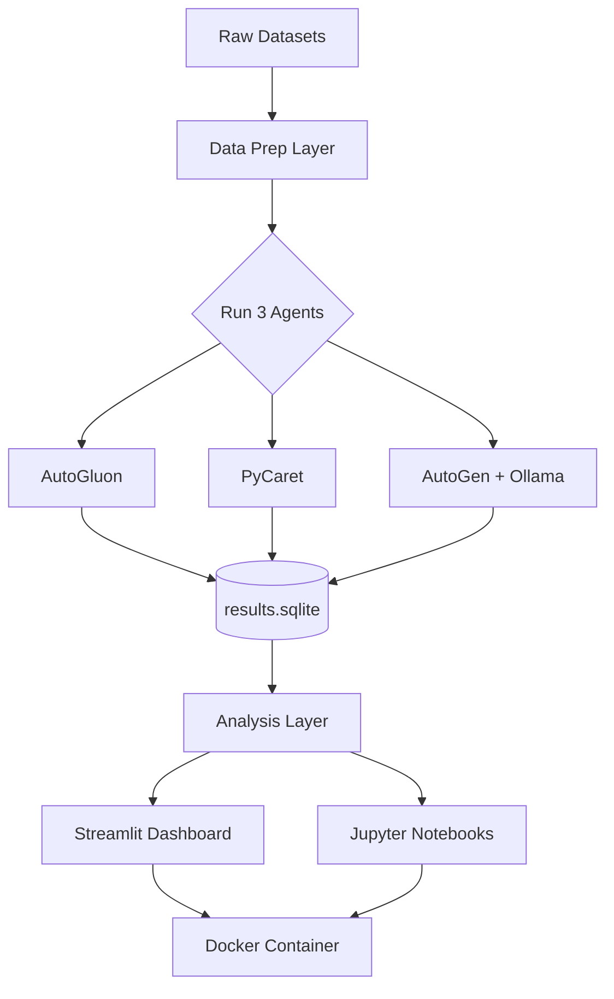
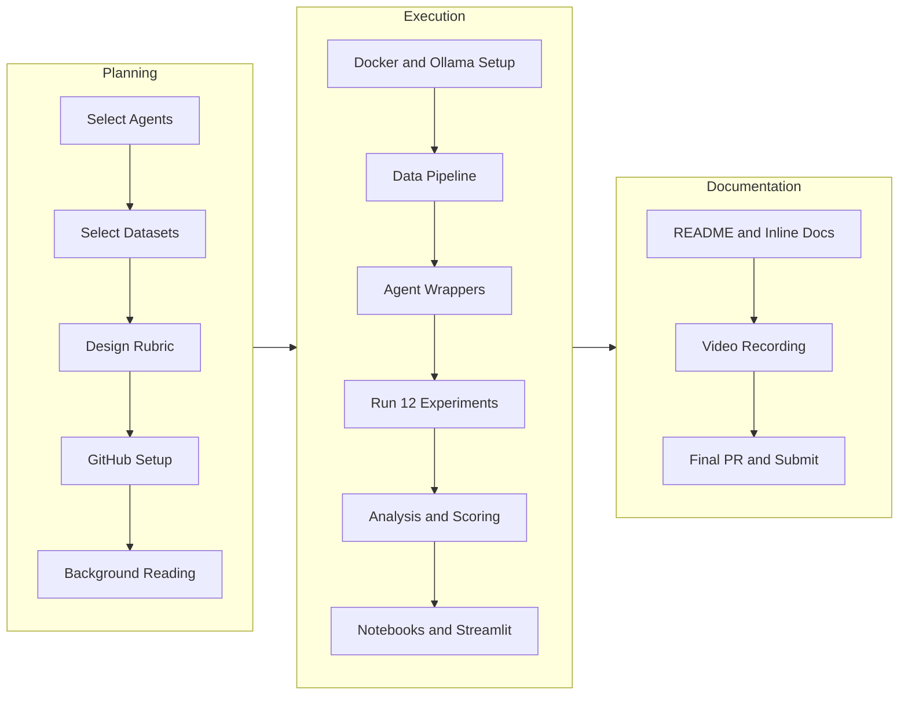
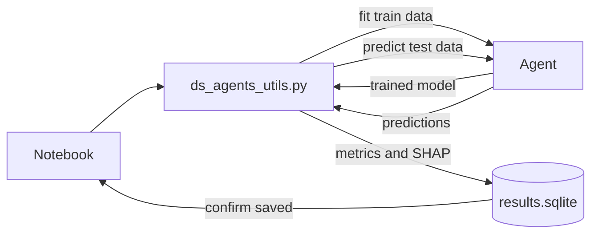
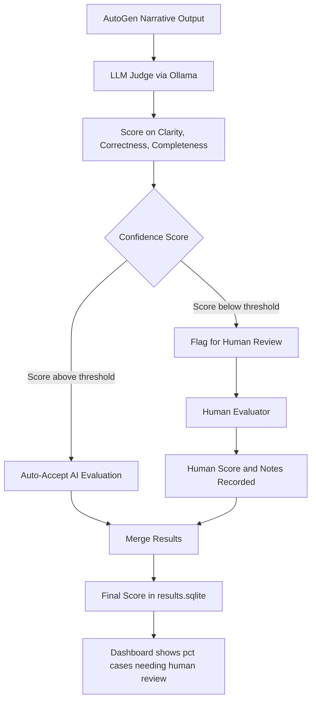
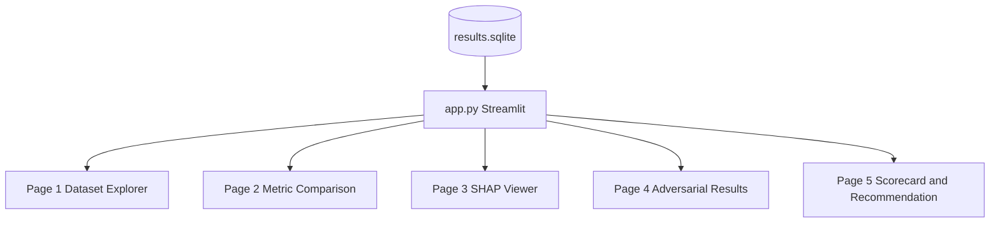
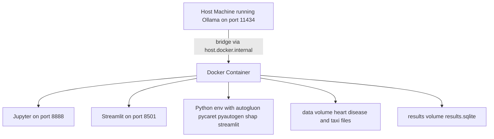

# Project Planning: Comparison of Data Science Agents
## DATA605 — Spring 2026 | University of Maryland MSDS

---

> **How to use this document:** This is our single source of truth. Every section is designed to be actioned directly. Check off tasks as we complete them. Push this file to GitHub — it renders Mermaid diagrams natively, making it fully collaborative and visually complete for the whole team.

---

## 1. Project Overview

**Project Title:** `Comparison_of_Data_Science_Agents`
**GitHub Tag:** `Spring2026_Comparison_of_Data_Science_Agents`
**Type:** Research Project + Interactive Dashboard
**Effort:** ~40 hours (6–8 full working days)
**Format:** "Learn X in 60 minutes" tutorial style
**Primary Deliverables:** `ds_agents.API.ipynb` + `ds_agents.example.ipynb` + `ds_agents_utils.py` + `app.py` (Streamlit) + `README.md` + video

**The Core Question:**
> *Which data science agents produce the best models, most readable code, and most useful insights — and under what conditions does each one fail?*

**Why we chose this project over alternatives:**
We selected this because it combines all three of our technical comfort areas: local LLMs via Ollama, ML modeling with tabular data, and data analysis with pandas. It has the highest technical depth ceiling of all options we considered. The addition of an interactive Streamlit dashboard further elevates it into the "Build X using Y" category on top of the core research project.

**Backup project:** Kafka Streaming Pipeline — recommended for its breadth across data engineering and its differentiation from our primary project's ML focus.

---

## 2. GitHub Setup and Workflow

We need to get GitHub set up before anything else — it unblocks everything downstream.

### Step-by-step Setup

```
Step 1: Create a GitHub issue
         Title: Spring2026_Comparison_of_Data_Science_Agents
         Body: Include project description, agent list, dataset list, evaluation rubric

Step 2: Note the issue number — we use it in the branch name
         Example: issue #712

Step 3: Create our working branch from main
         git checkout -b TutorTask712_Spring2026_Comparison_of_Data_Science_Agents

Step 4: Create our project folder
         DATA605/Spring2026/projects/TutorTask712_Spring2026_Comparison_of_Data_Science_Agents/

Step 5: Commit frequently with meaningful messages. Examples:
         "Add Dockerfile and requirements.txt for all three agents"
         "Add data loading utilities for Heart Disease and NYC Taxi"
         "Add AutoGluon wrapper and first benchmark run on Heart Disease"
         "Add PyCaret wrapper and compare_models benchmark"
         "Add AutoGen wrapper with Ollama integration"
         "Add adversarial injection functions and run failure mode experiments"
         "Add LLM-as-Judge evaluation pipeline with human fallback"
         "Add Streamlit dashboard with 5 pages"
         "Complete API.ipynb and example.ipynb with full inline documentation"
         "Add README.md and final polish"

Step 6: Submit first PR checkpoint when notebooks are running
         Add TAs and @gpsaggese as reviewers
         Request review on: file structure, Docker setup, notebook quality

Step 7: Incorporate all feedback from reviewers

Step 8: Submit final PR with the same reviewers

Step 9: Upload video to class Google Drive folder
         Share the link in the PR description
```

---

## 3. What We Need to Understand Before We Write a Single Line of Code

This section is for onboarding anyone on the team. Before touching code, every team member should be able to answer every question in this section. Estimated reading time: 3–4 hours.

### 3.1 What is this class project format?

The class uses a "Learn X in 60 minutes" format. That means our project is not just a working system — it is a **tutorial** that teaches someone else how to use these tools. Every notebook cell needs a markdown explanation above it. Every result needs an interpretation below it. We are writing for a reader who has never heard of AutoGluon, PyCaret, or AutoGen.

The required deliverables are:
- `ds_agents.API.ipynb` — walks through the raw API of each agent (what functions exist, how they work, what they return)
- `ds_agents.example.ipynb` — runs the full benchmark pipeline end-to-end on real data
- `ds_agents_utils.py` — all reusable logic lives here; notebooks only import from this file
- `app.py` — our Streamlit dashboard (our bonus depth dimension)
- `README.md` — documentation including setup instructions, API descriptions, diagrams, references
- Video — 10–20 minutes, 7 required steps (see Phase 3 section)

### 3.2 What is a Data Science Agent?

A Data Science Agent is a software system that can autonomously perform data science tasks — like training models, generating feature importance, or writing and running code — when given a dataset and a goal. The key distinction is that you give it high-level instructions (e.g., "train a classifier on this data and tell me which features matter") rather than writing every line of ML code yourself.

There are several architectural categories we need to understand:

**AutoML agents** (AutoGluon, PyCaret) work by automatically searching through many ML algorithms and hyperparameter configurations, then returning the best-performing model. They are deterministic, fast, and well-understood. Think of them as very smart hyperparameter search tools.

**Multi-agent systems** (AutoGen) work differently. Two or more AI agents — each with a different role — pass messages back and forth to solve a problem collaboratively. An `AssistantAgent` might write Python code, while a `UserProxyAgent` executes it and reports the result back. This process repeats until the task is solved. The language model powering these agents is what makes them generative — they produce novel code and explanations, not just search through a predefined space.

**Natural language interfaces** (PandasAI) let you query your DataFrame in plain English ("What is the average fare by pickup zone?") and get back results. These are less about model training and more about interactive data exploration.

Understanding these architectural differences is essential because it explains why we expect different results from each agent type — and it is the core intellectual contribution of our comparison.

### 3.3 What is Ollama and why do we need it?

Ollama is a tool that lets us run large language models locally on our machine. Instead of paying for OpenAI API calls, we download and run `llama3` or `mistral` ourselves. Ollama exposes these models as a local HTTP API on port 11434, compatible with the OpenAI API format.

We need Ollama specifically to power AutoGen. AutoGen needs a language model to generate code and explanations. Without Ollama (or some other LLM backend), AutoGen cannot function. With Ollama, the entire project is free.

The networking challenge: when AutoGen runs inside our Docker container, it needs to reach Ollama which is running on our host machine. The address for this is `host.docker.internal:11434`. Testing this on Day 1 is the most important risk mitigation step in the whole project.

### 3.4 What is Docker and why does the class require it?

Docker creates a reproducible environment. When we run `docker_build.sh`, it builds a container image with exactly the right Python version, exactly the right package versions, and exactly the right file layout — on any machine. When the graders or our teammates run our project, they get the same environment we tested in.

The class requires Docker because "it works on my machine" is not an acceptable answer in a team or professional context. Our project must run inside Docker, and both notebooks must execute completely after a kernel restart inside the container.

We need to understand four shell scripts:
- `docker_build.sh` — builds the Docker image (run once, or after changing Dockerfile)
- `docker_bash.sh` — opens a bash shell inside the container for debugging
- `docker_jupyter.sh` — starts Jupyter server inside the container, accessible at `localhost:8888`
- `docker_clean.sh` — removes the container and image to free disk space

### 3.5 What is SHAP and why does it matter for our project?

SHAP (SHapley Additive exPlanations) is a method for explaining the output of any ML model. For each prediction, SHAP tells us which features pushed the prediction up, which pushed it down, and by how much. This is our primary explainability tool.

AutoGluon provides SHAP-based importance via `predictor.feature_importance(data)`. PyCaret provides it via `interpret_model(best_model)`. AutoGen generates natural language explanations instead — which is what we evaluate using our LLM-as-Judge pipeline.

SHAP is important for our project because it is one of our five evaluation dimensions (weighted at 20%). It is also genuinely useful: a model with worse accuracy but better explainability might be preferred in a medical context. Our sensitivity analysis explores exactly this tradeoff.

### 3.6 What is SQLite and how do we use it?

SQLite is a file-based relational database — one `.sqlite` file on disk, no server required. We use it to store all our benchmark results: metrics, SHAP values, runtime, experiment tags, and LLM judge scores.

Why use a database instead of just a CSV? Because we run 12+ experiments and need to slice them in many ways (by agent, by dataset, by condition, by metric). Pandas can query SQLite directly via `pd.read_sql("SELECT ... FROM results WHERE ...", conn)`, and Streamlit can read from it the same way. It is also more robust than a CSV if we need to rerun individual experiments without clobbering previous results.

### 3.7 What is Streamlit and what are we building with it?

Streamlit is a Python library that turns a Python script into a web app. No HTML, no JavaScript, no React required — just Python with Streamlit function calls (`st.write()`, `st.bar_chart()`, `st.slider()`). The whole dashboard is a single file `app.py`.

Our dashboard has 5 pages: Dataset Explorer, Metric Comparison (bar + radar charts), SHAP Viewer, Adversarial Results, and a Composite Scorecard with live weight sliders. The key feature is that when someone drags the "explainability" weight slider up, the agent rankings update in real time. This makes the sensitivity analysis interactive and intuitive.

### 3.8 What background reading do we need to do?

Before writing any code, every team member should read:

**Conceptual reads (understand what each tool is):**
- AutoGluon tabular quickstart: `https://auto.gluon.ai/stable/tutorials/tabular/tabular-quick-start.html` — focus on `TabularPredictor.fit()`, `predict()`, `evaluate()`, `feature_importance()`
- PyCaret quickstart: `https://pycaret.gitbook.io/docs/get-started/quickstart` — focus on `setup()`, `compare_models()`, `predict_model()`, `interpret_model()`
- AutoGen multi-agent tutorial: `https://github.com/microsoft/autogen` — focus on `AssistantAgent` + `UserProxyAgent` pattern and the `initiate_chat()` method
- Ollama quickstart: `https://github.com/ollama/ollama` — understand how to run a local LLM and expose it as an API endpoint

**Technical reads (understand how to actually implement):**
- How to install AutoGluon inside Docker with CPU-only PyTorch — look for the official Docker install guide, it has specific steps for avoiding CUDA conflicts
- How to configure AutoGen to use Ollama instead of OpenAI — search for `OllamaWrapper` or `config_list` with `base_url` pointing to `http://host.docker.internal:11434/v1`
- How to extract SHAP values from AutoGluon: `predictor.feature_importance(data)` — this returns SHAP-based importance scores, not permutation importance
- How to extract SHAP values from PyCaret: `interpret_model(best_model)` — calls the SHAP library internally
- How to connect Streamlit to SQLite: use `sqlite3.connect()` or `sqlalchemy` + `pd.read_sql()` inside a Streamlit app

**Grading-relevant reads:**
- Look at the `tutorials/autogen` example in the `umd_classes` repository — this is the closest reference for expected notebook structure and documentation depth
- Watch 2–3 previous student project videos from the class Google Drive folder to calibrate the expected depth, presentation style, and length

---

## 4. Agent Selection Strategy

We are benchmarking 3 agents from different categories. All are free, all run locally, all work inside Docker.

| Agent | Category | Why We Picked It | Free? | Local? |
|---|---|---|---|---|
| **AutoGluon** | AutoML | Best-in-class tabular ML, pip installable, no API key needed, supports both classification and regression | ✅ | ✅ |
| **PyCaret** | Experiment / AutoML | Low-code, fast, produces outstanding comparison tables across many ML algorithms in a single call | ✅ | ✅ |
| **AutoGen + Ollama** | Multi-agent framework | Multiple AI agents collaborate with each other using a locally-hosted LLM — our "going deep" technical angle | ✅ | ✅ |
| **PandasAI** *(optional 4th)* | Natural language data analysis | Natural language interface for querying DataFrames; runs fully locally with an Ollama backend | ✅ | ✅ |

### Why We Ruled Out Others

We explicitly considered and rejected these options:

- **Devin** — paid and commercial; not accessible without a subscription
- **ChatGPT Advanced Data Analysis** — requires an OpenAI paid account; not reproducible by classmates or graders
- **Open Interpreter** — unstable Docker support; high risk of environment failures during demo
- **Jupyter AI** — requires an API key for any meaningful use; adds cost or workaround complexity
- **CrewAI** — architecturally overlaps with AutoGen; redundant to include both
- **LangGraph** — excellent tool but better suited as the foundation of its own standalone project

### Why AutoGen + Ollama Is the Centerpiece

Running AutoGen with a local Ollama model keeps the entire project free and adds genuine technical complexity that most student projects lack. We are orchestrating multiple AI agents — an `AssistantAgent` and a `UserProxyAgent` — that pass messages to each other using a locally-hosted language model with zero external API calls. This is publishable-quality system design.

The key configuration we use:

```python
config_list = [{
    "model": "llama3",
    "base_url": "http://host.docker.internal:11434/v1",
    "api_key": "ollama"
}]
```

---

## 5. Dataset Selection

We are using 2 datasets. Quality over quantity — two well-chosen datasets within 40 hours beats four shallow ones.

### Dataset 1: Heart Disease (UCI / Kaggle)

- **Task type:** Binary classification (predict presence or absence of heart disease)
- **Size:** ~303 rows, 14 features (age, sex, cholesterol, chest pain type, etc.)
- **Why we chose it:** Small and fast — every agent finishes in seconds. The domain is well-understood. Perfect for comparing accuracy, feature importance, and SHAP explanations across agents without long training waits.
- **Data quality profile:** Clean — minimal missing values by default, making it our "clean data" baseline.
- **Adversarial use:** We inject 20% missing values and a 9:1 class imbalance into this dataset to create our "adversarial" test condition.
- **Access:** Free Kaggle download; no auth token required. Also available from the UCI ML Repository.
- **Target column:** `target` (1 = heart disease, 0 = no heart disease)

### Dataset 2: NYC Yellow Taxi Trip Records

- **Task type:** Regression (predict fare amount or tip amount per trip)
- **Size:** 50,000 rows sampled from January 2023 Parquet file
- **Why we chose it:** Large, real-world, messy — datetime features, outliers, missing GPS coordinates, vendor-specific encoding quirks. Tests how agents handle scale, feature engineering, and imperfect data. This is where AutoGluon and PyCaret shine and where AutoGen will likely struggle.
- **Data quality profile:** Messy — missing values, outliers in fare and distance columns, datetime parsing required.
- **Access:** Fully public, no authentication. Direct Parquet download from the NYC TLC open data portal.
- **Target column:** `fare_amount` (regression) or `tip_amount` (regression — more interesting distribution)

### Why These Two Specifically

Heart Disease gives us a clean, fast, small classification baseline. Taxi gives us a large, messy, slow regression stress test. Together they cover two task types (classification and regression), two data quality profiles (clean vs. messy), and two dataset sizes (small vs. large). Our professor will notice this design decision — it shows we thought carefully about what we are measuring.

---

## 6. Evaluation Framework

We define the rubric upfront so every agent is judged identically. Defining weights before running experiments eliminates the bias of adjusting weights after seeing results.

### Weighted Scoring Rubric

| Dimension | Weight | What We Measure |
|---|---|---|
| **Model Performance** | 35% | Accuracy + F1 (classification); RMSE + MAE (regression) |
| **Runtime** | 15% | Wall-clock training time in seconds, measured by our wrapper |
| **Code Quality** | 20% | Readability, modularity, re-runs after kernel restart |
| **Explainability** | 20% | SHAP values present, feature importance ranked, narrative quality for AutoGen |
| **Error Handling** | 10% | How each agent handles missing values and class imbalance: crash, silent failure, or warning |

### How We Compute Composite Scores

For each agent on each dataset we:
1. Normalize each raw metric to a 0–10 scale using min-max normalization across agents (best agent gets 10, worst gets 0)
2. Multiply each normalized score by its weight
3. Sum to get the composite score out of 10
4. Store in `results.sqlite` and display in the Streamlit scorecard

### Sensitivity Analysis Weight Configurations

We re-run scoring under three alternative configurations to show how rankings change:

- **Speed Matters Most:** Runtime 40%, Performance 30%, Code Quality 15%, Explainability 10%, Error Handling 5%
- **Explainability Matters Most:** Explainability 40%, Performance 30%, Code Quality 20%, Runtime 5%, Error Handling 5%
- **Balanced:** All five dimensions equally weighted at 20%

If agent rankings change when we shift weights, we have an interesting result. If they stay the same, that is also meaningful — it means the winner is robust across evaluation philosophies.

---

## 7. Full Project Architecture



---

## 8. Repository Structure

We follow the class README's required folder structure exactly:

```
DATA605/
└── Spring2026/
    └── projects/
        └── TutorTask{N}_Spring2026_Comparison_of_Data_Science_Agents/
            ├── ds_agents_utils.py          # ALL reusable logic — no complex code inline in notebooks
            ├── ds_agents.API.ipynb         # Tool API exploration — understand each agent's interface
            ├── ds_agents.example.ipynb     # End-to-end benchmark pipeline
            ├── app.py                      # Streamlit dashboard
            ├── data/
            │   ├── heart_disease.csv
            │   └── taxi_sample.parquet
            ├── results/
            │   ├── results.sqlite
            │   └── flagged_reviews.csv
            ├── Dockerfile
            ├── docker_build.sh
            ├── docker_bash.sh
            ├── docker_jupyter.sh
            ├── docker_clean.sh
            ├── requirements.txt
            └── README.md
```

### The Rule About `ds_agents_utils.py`

Every reusable function must live in `ds_agents_utils.py`. Notebooks only import from it. This is an explicit grading criterion — notebooks with complex logic inline instead of in utils will lose points. It also makes our code testable and readable independently of notebook state.

---

## 9. Phase-by-Phase Execution Plan

### PHASE 1 — Planning (Current Phase)
*Know exactly what we are building before writing a single line of code. Decisions made here save 10x the time later.*

- [x] Read and understand all README requirements for the class project
- [x] Select primary project: Comparison of Data Science Agents
- [x] Select backup project: Kafka Streaming Pipeline
- [ ] Finalize agent selection (AutoGluon + PyCaret + AutoGen — confirmed above)
- [ ] Finalize dataset selection (Heart Disease + NYC Taxi — confirmed above)
- [ ] Finalize evaluation rubric weights (35 / 15 / 20 / 20 / 10 — confirmed above)
- [ ] Create GitHub issue
- [ ] Note issue number and create branch with correct naming convention
- [ ] Fork and clone `umd_classes` repo
- [ ] Copy project template files into our project directory
- [ ] Set up local environment: install Docker Desktop, install Ollama, pull `llama3` or `mistral`
- [ ] Complete all background reading from Section 3

---

### PHASE 2 — Project Execution (~30 hours)

---

#### WEEK 1 — Infrastructure + Data (~15 hours)

---

**Day 1–2: Docker + Environment Setup (~6 hours)**

This is the most technically risky part of the project. We do it first, before any data or analysis work, so we find problems early.

- [ ] Write `Dockerfile`:
  - Base image: `python:3.11-slim` (avoids CUDA complications)
  - Install system dependencies: `build-essential`, `git`, `curl`
  - Install Python packages from `requirements.txt`
  - Expose ports 8888 (Jupyter) and 8501 (Streamlit)
  - Set working directory to `/workspace`
  - Copy project files into image
- [ ] Write `requirements.txt` with all versions pinned (see Section 12 for exact versions)
- [ ] Write and verify all four Docker shell scripts
- [ ] Install Ollama locally on the host machine: `https://ollama.com`
- [ ] Pull our model: `ollama pull llama3` (3.8GB) or `ollama pull mistral` (4.1GB)
- [ ] Verify Ollama is serving: `curl http://localhost:11434/api/tags`
- [ ] **CRITICAL TEST — Day 1:** Write a minimal Python script inside Docker that calls Ollama via `host.docker.internal:11434`. If this fails, AutoGen integration fails. Solve networking on Day 1, not Day 6.
- [ ] Configure AutoGen `config_list`:
  ```python
  config_list = [{
      "model": "llama3",
      "base_url": "http://host.docker.internal:11434/v1",
      "api_key": "ollama"
  }]
  ```

> ⚠️ **Risk note:** AutoGluon has specific PyTorch dependencies that can conflict with other packages. Use CPU-only PyTorch (`pip install torch --index-url https://download.pytorch.org/whl/cpu`) to avoid CUDA conflicts inside Docker. Install AutoGluon first, then PyCaret, to manage the dependency tree.

---

**Day 3: Data Pipeline (~4 hours)**

- [ ] Download Heart Disease from Kaggle or UCI — save to `data/heart_disease.csv`
  - Verify: 303 rows, 14 columns, no extra index columns
- [ ] Download NYC Taxi Parquet for January 2023:
  - URL: `https://d37ci6vzurychx.cloudfront.net/trip-data/yellow_tripdata_2023-01.parquet`
  - Sample 50,000 rows — save to `data/taxi_sample.parquet`
- [ ] Write these functions in `ds_agents_utils.py`:

```python
def load_heart_disease(data_dir: str = "data/") -> pd.DataFrame:
    """Load Heart Disease dataset. Returns clean DataFrame with correct dtypes.
    Target column: 'target' (1 = disease, 0 = no disease)."""

def load_taxi_sample(data_dir: str = "data/", n_rows: int = 50000) -> pd.DataFrame:
    """Load NYC Yellow Taxi sample. Drops rows with missing fare_amount.
    Parses pickup/dropoff datetime. Target column: 'fare_amount'."""

def inject_missing_values(df: pd.DataFrame, pct: float = 0.20,
                           random_state: int = 42) -> pd.DataFrame:
    """Randomly set pct fraction of non-target values to NaN.
    Used for adversarial failure mode experiments."""

def inject_class_imbalance(df: pd.DataFrame, target_col: str,
                            majority_class: int = 0,
                            ratio: float = 9.0,
                            random_state: int = 42) -> pd.DataFrame:
    """Undersample minority class to create ratio:1 imbalance.
    Used for adversarial failure mode experiments."""
```

- [ ] Write a validation script that loads both datasets and prints shape, dtypes, and null counts
- [ ] Test both inject functions and verify they produce expected distributions

---

**Day 4–5: Agent Harness (~5 hours)**

Every wrapper returns the same dictionary structure so our analysis layer can treat all agents identically:

```python
def run_autogluon(df: pd.DataFrame, target: str,
                  task_type: str = "binary",
                  time_limit: int = 60) -> dict:
    """Fits AutoGluon TabularPredictor. Returns:
    {agent, accuracy, f1, rmse, runtime_seconds,
     feature_importance, model_path, error}"""

def run_pycaret(df: pd.DataFrame, target: str,
                task_type: str = "classification") -> dict:
    """Runs PyCaret setup() + compare_models() + predict().
    Extracts SHAP values via interpret_model().
    Returns same dict structure as run_autogluon."""

def run_autogen(df: pd.DataFrame, target: str,
                task_type: str = "binary") -> dict:
    """Runs AutoGen AssistantAgent + UserProxyAgent pipeline.
    Returns same dict structure plus:
    generated_code: str, narrative_explanation: str"""

def save_results(results: dict, db_path: str = "results/results.sqlite",
                 experiment_tag: str = "normal") -> None:
    """Saves results dict to SQLite. Creates table if not exists.
    experiment_tag: 'normal' or 'adversarial'."""

def load_results(db_path: str = "results/results.sqlite") -> pd.DataFrame:
    """Returns a DataFrame of all stored results for analysis."""
```

- [ ] Implement `run_autogluon` — test on Heart Disease with `time_limit=60`
- [ ] Implement `run_pycaret` — test on Heart Disease, verify `compare_models()` completes
- [ ] Implement `run_autogen` — test with a minimal DataFrame, verify Ollama call succeeds
- [ ] Implement `save_results` and `load_results` — verify round-trip works correctly

---

#### WEEK 2 — Benchmarking + Analysis (~15 hours)

---

**Day 6: Run All Benchmark Experiments (~4 hours)**

Our full experiment matrix:

| Condition | Agents | Datasets | Runs |
|---|---|---|---|
| Normal (clean data) | AutoGluon, PyCaret, AutoGen | Heart Disease, NYC Taxi | 3 × 2 = 6 |
| Adversarial (20% missing + 9:1 imbalance) | AutoGluon, PyCaret, AutoGen | Heart Disease only | 3 × 1 = 3 |
| **Total** | | | **12 controlled runs** |

- [ ] Run 6 normal experiments; save to `results.sqlite` with `experiment_tag="normal"`
- [ ] Run 3 adversarial experiments; save with `experiment_tag="adversarial"`
- [ ] Run each experiment at least twice to check consistency (AutoGen non-determinism is expected)
- [ ] Log all outputs — including errors, warnings, and crash traces — to a text file
- [ ] Document for each agent: did it crash, silently fail, or warn?

---

**Day 7: Analysis Layer (~4 hours)**

- [ ] Load all results from SQLite using `load_results()`
- [ ] Compute normalized composite scores under baseline weights (35/15/20/20/10)
- [ ] Re-compute composite scores under all three alternative weight configurations (sensitivity analysis)
- [ ] Extract and normalize SHAP feature importance from AutoGluon and PyCaret
- [ ] For AutoGen: run the LLM-as-Judge pipeline with human fallback (see Section 11 — Depth Dimension 2)
- [ ] Compute pairwise Pearson correlations across all metrics
- [ ] Build summary scorecard table: agents as rows, metrics + composite score as columns
- [ ] Identify the winner under each weight configuration — note whether rankings change

---

**Day 8: Notebooks + Dashboard (~7 hours)**

**`ds_agents.API.ipynb` structure:**

- Section 1: What is a Data Science Agent? (conceptual overview — what problem does this category solve?)
- Section 2: AutoGluon API walkthrough (demonstrate `TabularPredictor.fit()` and `.predict()` on synthetic data)
- Section 3: PyCaret API walkthrough (demonstrate `setup()`, `compare_models()`, `predict_model()` on synthetic data)
- Section 4: AutoGen API walkthrough (demonstrate `AssistantAgent` + `UserProxyAgent` conversation on a simple task)
- Section 5: Our wrapper layer explained (show all wrapper functions with annotated code)

**`ds_agents.example.ipynb` structure:**

- Section 1: Load and explore both datasets
- Section 2: Run all experiments on clean data
- Section 3: Run adversarial experiments
- Section 4: Load and analyze all results
- Section 5: SHAP explainability analysis
- Section 6: LLM-as-Judge evaluation with human fallback
- Section 7: Composite scorecard + sensitivity analysis
- Section 8: Conclusions — which agent won, why, when to use each one, limitations

**`app.py` Streamlit dashboard:**

- **Page 1 — Dataset Explorer:** Filter by dataset, agent, and condition. Show raw metrics in a sortable table.
- **Page 2 — Metric Comparison:** Side-by-side bar charts per metric. Radar chart for all dimensions at once.
- **Page 3 — SHAP Explainability Viewer:** Top-10 feature importance from AutoGluon and PyCaret side by side.
- **Page 4 — Adversarial Results:** Show how each agent's metrics changed between clean and adversarial conditions. Highlight crashes and silent failures.
- **Page 5 — Composite Scorecard + Recommendation Engine:** Weighted scorecard table. Live weight sliders — drag to change weights and watch rankings update in real time. "Based on your priorities, we recommend: [Agent X]" output.

---

### PHASE 3 — Documentation + Presentation (~10 hours)

---

**Day 9: Documentation (~5 hours)**

**Write `README.md` covering:**
- What are Data Science Agents, and why does it matter which one you use?
- What problem our project solves and who should use this guide
- Overview of alternatives: commercial tools vs. open source — pros and cons of each
- Architecture overview with Mermaid diagram
- Prerequisites and Docker setup instructions
- API description: every function in `ds_agents_utils.py` with parameters, return types, and examples
- References: AutoGluon paper, PyCaret docs, AutoGen paper, Ollama docs, dataset links

**Add inline documentation to notebooks:**
- Every code cell must have a markdown cell above it explaining what the code does and why
- Every output must have a markdown cell below it interpreting the result
- Add Mermaid diagrams inline where they help understanding (e.g., the experiment flow diagram before the benchmark loop)

---

**Day 10: Video + Final Polish (~5 hours)**

**Record 10–20 minute video following all 7 required steps:**

1. **Introduction** — State name, UID, tool name (Comparison of Data Science Agents), difficulty level, and project title
2. **File showcase** — Walk through the PR file tree. Show every required file and explain its purpose. Explain naming conventions.
3. **Docker execution** — Run `docker_build.sh`. Show build succeeding. Run `docker_bash.sh` and show the environment (`python --version`, `pip list | grep autogluon`).
4. **Jupyter launch** — Run `docker_jupyter.sh`. Show Jupyter loading in the browser.
5. **Full project walkthrough** — Run every cell in both notebooks top to bottom while explaining verbally. Show the Streamlit dashboard running.
6. **Results discussion** — Which agent won on Heart Disease? Which on Taxi? Did rankings change between clean and adversarial? Did any agent crash or silently fail? What would we recommend to a practitioner?
7. **Documentation review** — Show `README.md` and walk through its sections. Show inline notebook documentation.

**Final PR cleanup:**
- [ ] Run `linters2/lint_branch.sh` if available in the repo
- [ ] Verify all commit messages are meaningful (not "fix", "update", "wip")
- [ ] Verify both notebooks run end-to-end after Kernel → Restart & Run All
- [ ] Confirm Docker build produces no warnings or errors
- [ ] Add TAs and `@gpsaggese` as PR reviewers
- [ ] Upload video to class Google Drive and add link to PR description

---

## 10. Detailed Mermaid Diagrams

### 10.1 Overall Project Flow



### 10.2 Experiment Run Flow



### 10.3 LLM-as-Judge with Human Evaluation Fallback



### 10.4 Streamlit Dashboard Architecture



### 10.5 Docker Container Design



### 10.6 40-Hour Time Budget

```mermaid
gantt
    title Project Timeline - 40 Hours Total
    dateFormat  X
    axisFormat  %s hrs

    section Phase 1 Planning
    Agent and Dataset Selection       :done,    p1, 0, 2
    GitHub Issue and Branch Setup     :done,    p2, 2, 4
    Background Reading and Research   :active,  p3, 4, 7

    section Phase 2 Execution
    Docker and Ollama Environment     :         e1, 7, 13
    Data Pipeline and Utils           :         e2, 13, 17
    Agent Wrappers                    :         e3, 17, 22
    Run 12 Experiments                :         e4, 22, 26
    Analysis and Scoring Layer        :         e5, 26, 30
    Notebooks and Streamlit Dashboard :         e6, 30, 37

    section Phase 3 Documentation
    README and Inline Notebook Docs   :         d1, 37, 41
    Video Recording and Final PR      :         d2, 41, 45
```



---

## 11. Four Depth Dimensions — What Makes Our Project Outstanding

These four dimensions are what separate an outstanding project from a good one. They are what make this memorable as a portfolio piece.

---

### Depth Dimension 1 — Adversarial Experiments

We do not just run agents on clean data. We deliberately inject 20% missing values and a 9:1 class imbalance into the Heart Disease dataset, then document exactly how each agent handles it.

**What we measure and document:**
- Does the agent crash with an exception? (Record the full exception message)
- Does it silently produce a wrong result without any warning? (Most dangerous — this is the outcome we want to flag)
- Does it issue a warning and proceed? (Acceptable behavior)
- Does it automatically handle the degraded data? (Ideal behavior)

**Why this matters:** This is genuinely novel analysis that most student projects skip entirely. Real data is always messy. An agent that looks great on clean UCI data but silently fails on real-world data is worse than useless — it is dangerous. Documenting this failure mode analysis is what separates a tutorial from a research contribution.

**Implementation:** Use `inject_missing_values(df, pct=0.20)` and `inject_class_imbalance(df, target_col='target', ratio=9.0)` from `ds_agents_utils.py`, then run the same three wrappers on the degraded data.

---

### Depth Dimension 2 — LLM-as-Judge with Human Evaluation Fallback

We use a local Ollama model to automatically evaluate the quality of AutoGen's narrative explanations — using one AI to evaluate another. This is meta-level analysis that shows genuine depth.

**The LLM-as-Judge system:**

For each AutoGen narrative, we send it to a second Ollama call with this prompt:

```
You are an expert data science teacher. Evaluate the following explanation
of a machine learning result on a scale of 1-10 for each dimension:

1. Clarity: Is the explanation clear and understandable to a data scientist?
2. Correctness: Is the technical content accurate and not misleading?
3. Completeness: Does it cover the key aspects of the result?

Return a JSON object with keys: clarity, correctness, completeness, confidence.
The confidence field (1-10) represents how certain you are in your evaluation.

Explanation to evaluate:
{narrative}
```

**The human evaluation fallback — our new addition:**

Not every LLM evaluation is equally trustworthy. When the judge's confidence score falls below a defined threshold (e.g., `confidence < 7.0`), we flag the case for manual human review rather than auto-accepting it.

This creates a **hybrid evaluation system:**
- **High-confidence cases (confidence >= 7.0):** AI evaluation is accepted automatically, stored with `source = "AI"`
- **Low-confidence cases (confidence < 7.0):** Written to `flagged_reviews.csv` with columns: `narrative_id`, `narrative_text`, `ai_scores`, `ai_confidence`, `reason_for_flagging`
- **Human review:** We score each flagged narrative on the same three dimensions and record our scores and notes
- **Merge:** Final scores combine AI auto-accepted results and human overrides in `results.sqlite`, with a `source` column (`"AI"` or `"Human"`)

**What we analyze and report:**
- What percentage of AutoGen narratives required human review? (A quality signal about output consistency)
- Did human and AI scores agree on flagged cases? (Inter-rater reliability)
- Were there patterns in which narratives triggered the fallback (e.g., longer explanations, regression vs. classification)?
- How does the choice of threshold (7.0 vs. 6.0 vs. 8.0) affect the percentage flagged?

This turns the evaluation from a black box into an auditable, human-in-the-loop quality control system — exactly how production AI evaluation pipelines work.

---

### Depth Dimension 3 — Composite Scorecard with Sensitivity Analysis

We do not just present one weighted score and declare a winner. We show what happens when we change the weights.

**The key question:** If a practitioner cares more about explainability than speed, does the agent ranking change? If it does, that is a highly informative finding — the best agent depends on your use case. If it does not, that is also informative — the winner is robust.

We compute scores under four weight configurations (our baseline plus the three alternatives from Section 6) and present a heatmap or side-by-side table showing how each agent's composite score changes across them.

This is what separates data science thinking from engineering thinking: understanding what the numbers mean and when they change.

---

### Depth Dimension 4 — Streamlit Dashboard

A working interactive app that a non-technical person can use to explore our results. The key differentiating feature is the live weight slider on the scorecard page — when someone drags the explainability weight up and the runtime weight down, the agent rankings update in real time. This makes the sensitivity analysis tangible and memorable.

Built entirely in Python with Streamlit — no React, no JavaScript, no frontend skills required. Single file (`app.py`) running inside the same Docker container as our notebooks.

---

## 12. Required Tools and Setup Checklist

### Local Machine Setup

- [ ] Docker Desktop installed and running — verify with `docker ps`
- [ ] Ollama installed from `https://ollama.com` — verify with `ollama --version`
- [ ] Model pulled: `ollama pull llama3` or `ollama pull mistral`
- [ ] Verify Ollama API: `curl http://localhost:11434/api/tags`
- [ ] Git configured with SSH key for GitHub
- [ ] `umd_classes` repo cloned: `git clone git@github.com:gpsaggese/umd_classes.git`
- [ ] Project branch created with correct naming convention
- [ ] GitHub issue created, assigned, issue number noted

### `requirements.txt` — Pin All Versions

```
# Core agents
autogluon==1.1.1
pycaret==3.3.2
pyautogen==0.2.35

# Explainability
shap==0.45.0

# Dashboard
streamlit==1.35.0
plotly==5.20.0

# Data
pandas==2.2.0
numpy==1.26.0
pyarrow==15.0.0
scikit-learn==1.4.0
datasets==2.18.0

# Visualization
matplotlib==3.8.0
seaborn==0.13.0

# Storage
sqlalchemy==2.0.0

# Utilities
requests==2.31.0
jupytext
```

> Install order matters: AutoGluon first, then PyCaret. Use CPU-only PyTorch:
> `pip install torch --index-url https://download.pytorch.org/whl/cpu`

---

## 13. Risk Register

| Risk | Likelihood | Impact | Our Mitigation |
|---|---|---|---|
| AutoGluon Docker install fails due to PyTorch/CUDA conflicts | Medium | High | Use CPU-only PyTorch before installing AutoGluon |
| AutoGen to Ollama networking broken inside Docker | Medium | High | Test specifically on Day 1; use `host.docker.internal`; on Linux use `--add-host=host.docker.internal:host-gateway` |
| Ollama model too slow for 50k-row Taxi dataset | Medium | Medium | Use Heart Disease as AutoGen's primary dataset; run only AutoGluon + PyCaret on Taxi; document as a finding about scalability |
| PyCaret version conflicts with AutoGluon | Low–Medium | Medium | Install AutoGluon first, then PyCaret; use a separate pip venv inside Docker if needed |
| NYC Taxi Parquet download is slow or URL changes | Low | Low | Download once locally, add to `data/` folder, mount as Docker volume — never re-download inside container |
| Notebook does not run end-to-end after kernel restart | Medium | High | Test Kernel → Restart and Run All before every PR commit — mandatory pre-commit check |
| AutoGen produces non-deterministic outputs | Medium | Low | Run each AutoGen experiment at least twice; average the results; document variance as a finding |
| LLM judge produces inconsistent confidence scores | Low | Low | Document threshold choice and show sensitivity to threshold — this is an interesting finding, not a failure |

---

## 14. Success Criteria Checklist

Before we call this project done, every item below must be checked.

### Required (40 points at stake)

- [ ] All required files in the correct folder structure
- [ ] `docker_build.sh` builds without errors
- [ ] `docker_jupyter.sh` launches Jupyter and both notebooks are accessible
- [ ] `ds_agents.API.ipynb` runs end-to-end after Kernel → Restart and Run All
- [ ] `ds_agents.example.ipynb` runs end-to-end after Kernel → Restart and Run All
- [ ] All complex logic in `ds_agents_utils.py` — not inline in notebooks
- [ ] `README.md` covers all required sections
- [ ] PR has meaningful commit history linked to the issue number
- [ ] Video is 10–20 minutes, uploaded to class Google Drive, link in PR description
- [ ] Video follows all 7 required steps in order

### Depth Indicators (what separates an A from a B)

- [ ] At least 3 agents benchmarked
- [ ] At least 2 datasets used
- [ ] Adversarial / failure mode experiments conducted and documented
- [ ] SHAP explainability analysis included for AutoGluon and PyCaret
- [ ] Composite scorecard with explicit weights documented and justified
- [ ] Streamlit dashboard working and fully runnable inside Docker
- [ ] LLM-as-Judge evaluation pipeline implemented for AutoGen narratives
- [ ] Human evaluation fallback with defined confidence threshold implemented and analyzed
- [ ] Sensitivity analysis on rubric weights showing how rankings change
- [ ] Percentage of cases requiring human review reported as a quality signal

---

## 15. Immediate Next Steps — Do These Now

1. **Create the GitHub issue** — takes 5 minutes, unblocks everything else
2. **Create the branch** with the correct naming convention
3. **Copy this file** into our project folder as `PLAN.md`
4. **Install Ollama** and pull the model: `ollama pull llama3`
5. **Verify Ollama works:** `curl http://localhost:11434/api/tags` — you should see a JSON response listing the model
6. **Start background reading** — AutoGluon quickstart first, then PyCaret, then AutoGen
7. **Write the Dockerfile on Day 1** and test the AutoGen to Ollama connection before any data or analysis work

The single highest-risk item in the entire project is the AutoGen to Ollama Docker networking. Everything else is execution, not problem-solving. Solve the networking on Day 1.

---

*Document last updated: March 2026. Maintained as part of DATA605 Spring 2026 — Comparison of Data Science Agents.*
