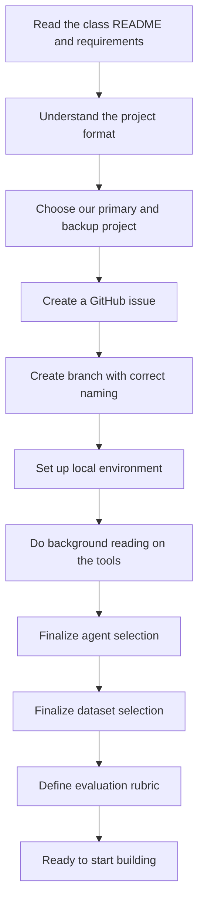
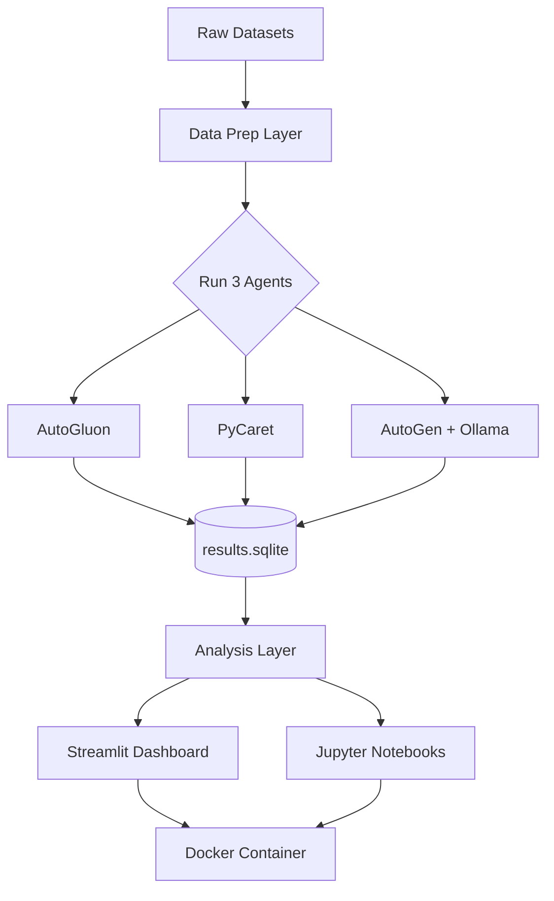
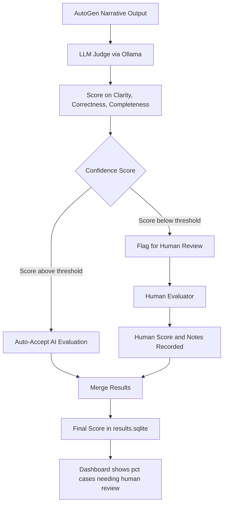
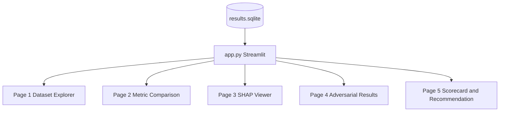
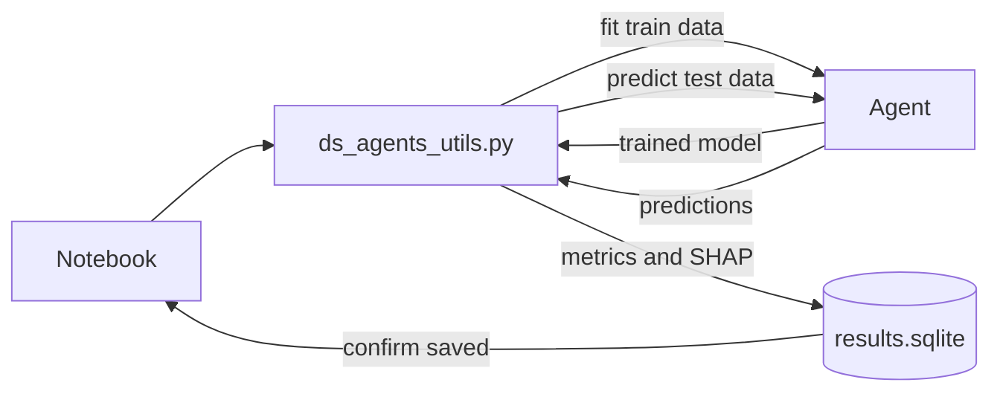
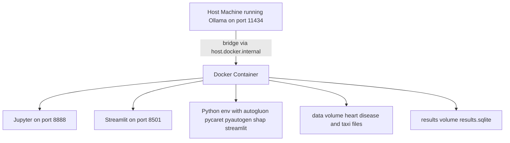

```mermaid
gantt
    title Project Timeline - 40 Hours Total
    dateFormat  X
    axisFormat  %s hrs

    section Phase 1 Planning
    Agent and Dataset Selection       :done,    p1, 0, 2
    GitHub Issue and Branch Setup     :done,    p2, 2, 4
    Background Reading and Research   :active,  p3, 4, 7

    section Phase 2 Execution
    Docker and Ollama Environment     :         e1, 7, 13
    Data Pipeline and Utils           :         e2, 13, 17
    Agent Wrappers                    :         e3, 17, 22
    Run 12 Experiments                :         e4, 22, 26
    Analysis and Scoring Layer        :         e5, 26, 30
    Notebooks and Streamlit Dashboard :         e6, 30, 37

    section Phase 3 Documentation
    README and Inline Notebook Docs   :         d1, 37, 41
    Video Recording and Final PR      :         d2, 41, 45
```

# Project Planning: Comparison of Data Science Agents
## DATA605 — Spring 2026 | University of Maryland MSDS

---

> **How to use this document:** This is our single source of truth and a starting point — nothing here is set in stone. Choices around agents, datasets, tools, and structure can and should evolve as we learn more. Push this file to GitHub — it renders Mermaid diagrams natively, making it fully collaborative for the whole team.

---

## 1. Planning Phase — At a Glance

Here is a quick map of everything we need to do before writing any code:



---

## 2. Project Overview

**Project Title:** `Comparison_of_Data_Science_Agents`
**GitHub Tag:** `Spring2026_Comparison_of_Data_Science_Agents`
**Type:** Research Project + Interactive Dashboard
**Effort:** ~40 hours
**Format:** "Learn X in 60 minutes" tutorial style
**Primary Deliverables:** `ds_agents.API.ipynb` + `ds_agents.example.ipynb` + `ds_agents_utils.py` + `app.py` + `README.md` + video

**The Core Question:**
> *Which data science agents produce the best models, most readable code, and most useful insights — and under what conditions does each one fail?*

**Why we chose this project:** It combines our technical comfort areas — local LLMs, ML modeling, and data analysis — while leaving room for genuine depth. The Streamlit dashboard (or a hosted website — see Section 8) elevates it beyond just notebooks.

**Backup project:** Metaflow — a workflow orchestration tool built by Netflix for managing data science pipelines. Good choice for data engineering depth and very different from our primary project.

---

## 3. GitHub Setup and Workflow

Get this done first — it unblocks everything else.

```
Step 1: Create a GitHub issue
         Title: Spring2026_Comparison_of_Data_Science_Agents

Step 2: Note the issue number (e.g., #712)

Step 3: Create our branch
         git checkout -b TutorTask712_Spring2026_Comparison_of_Data_Science_Agents

Step 4: Create our project folder
         DATA605/Spring2026/projects/TutorTask712_Spring2026_Comparison_of_Data_Science_Agents/

Step 5: Commit with meaningful messages throughout
         e.g. "Add Dockerfile", "Add AutoGluon wrapper", "Add Streamlit dashboard"

Step 6: First PR checkpoint → add TAs and @gpsaggese as reviewers

Step 7: Incorporate feedback → Final PR with same reviewers

Step 8: Upload video to class Google Drive, add link to PR
```

---

## 4. What We Need to Understand Before We Start

Before anyone writes code, we should all have a basic understanding of these concepts. No need to become experts — just enough to know what we're working with.

**The class project format:** This is a "Learn X in 60 minutes" tutorial. That means we're not just building a working system — we're teaching someone else how to use these tools. Every notebook cell needs an explanation above it. Every result needs an interpretation below it.

**What is a Data Science Agent?** A system that can autonomously perform data science tasks when given a dataset and a goal. Instead of writing every line of ML code yourself, you give it high-level instructions and it figures out the rest. Our three agents do this differently: AutoGluon and PyCaret search through many ML algorithms automatically (AutoML), while AutoGen uses AI agents that talk to each other to write and run code.

**What is Ollama?** A tool that runs large language models locally on our machine — no API key, no cost. It exposes the model as a local API on port 11434. We need it to power AutoGen for free.

**What is Docker?** A way to package our entire environment (code, packages, settings) into a container that runs identically on any machine. The class requires it so graders and teammates can reproduce our work exactly.

**What is SHAP?** A method for explaining ML model predictions — which features mattered most for each prediction, and by how much. We use it to score the "explainability" dimension of our rubric.

**What is Streamlit?** A Python library that turns a regular Python script into an interactive web app. No HTML or JavaScript needed. We use it for our results dashboard.

### Recommended Reading (just the quickstarts — don't go deeper yet)

- AutoGluon: `https://auto.gluon.ai/stable/tutorials/tabular/tabular-quick-start.html`
- PyCaret: `https://pycaret.gitbook.io/docs/get-started/quickstart`
- AutoGen: `https://github.com/microsoft/autogen` — focus on the AssistantAgent + UserProxyAgent example
- Ollama: `https://github.com/ollama/ollama` — just the README is enough to start

Also worth doing: look at the `tutorials/autogen` example in the `umd_classes` repo to see what the expected notebook style looks like.

---

## 5. Agent Selection

> **Note:** The agents below are our current best guess based on what we know now. This is not final — we can swap, add, or drop agents as we learn more during the project.

We benchmark 3 agents, all free and locally runnable:

| Agent | Category | Why |
|---|---|---|
| **AutoGluon** | AutoML | Best-in-class tabular ML, no API key, works for both classification and regression |
| **PyCaret** | Experiment / AutoML | Low-code, fast, great for comparing many algorithms at once |
| **AutoGen + Ollama** | Multi-agent | AI agents collaborate to write and run ML code using a local LLM — our "going deep" angle |
| **PandasAI** *(optional 4th)* | Natural language | Query DataFrames in plain English; free with Ollama backend |

**Agents we ruled out (for now):** Devin (paid), ChatGPT Advanced Data Analysis (requires OpenAI account), Open Interpreter (Docker issues), Jupyter AI (needs API key), CrewAI (redundant with AutoGen).

**Why AutoGen + Ollama is the centerpiece:** It adds genuine technical complexity — we're orchestrating multiple AI agents communicating with each other via a locally-hosted language model. Free, reproducible, and genuinely interesting.

---

## 6. Dataset Selection

> **Note:** These datasets are a solid starting point but not locked in. If we find something more interesting or better suited as we go, we should switch.

We use 2 datasets. Two well-chosen datasets done thoroughly beats four shallow ones.

**Dataset 1: Heart Disease (UCI / Kaggle)**
Binary classification task. About 300 rows, 14 features. Small and fast — every agent can run on it in seconds. Clean data by default, which makes it our baseline. We also use it for adversarial experiments by injecting missing values and class imbalance.

**Dataset 2: NYC Yellow Taxi Trip Records**
Regression task (predict fare or tip amount). We sample 50,000 rows from the January 2023 public Parquet file. Large and messy — tests how agents handle scale and imperfect real-world data. Free to download, no authentication required.

**Why these two:** Heart Disease is clean and small (easy baseline). Taxi is messy and large (stress test). Together they cover classification vs. regression, clean vs. messy, and small vs. large — making our comparison much more meaningful than using two similar datasets.

---

## 7. Evaluation Framework

We define the rubric before running experiments so every agent is judged identically.

| Dimension | Weight | What We Measure |
|---|---|---|
| **Model Performance** | 35% | Accuracy + F1 (classification); RMSE + MAE (regression) |
| **Runtime** | 15% | Wall-clock training time in seconds |
| **Code Quality** | 20% | Readability, modularity, re-runs after kernel restart |
| **Explainability** | 20% | SHAP values, feature importance, narrative quality for AutoGen |
| **Error Handling** | 10% | Does the agent crash, silently fail, or warn when data is messy? |

We compute a weighted composite score per agent per dataset, then re-run the scoring under alternative weight configurations (see Depth Dimension 3) to show how rankings change.

---

## 8. Full Project Architecture



---

## 9. Repository Structure

The class requires a specific folder layout. We follow it exactly:

```
DATA605/
└── Spring2026/
    └── projects/
        └── TutorTask{N}_Spring2026_Comparison_of_Data_Science_Agents/
            ├── README.md
            ├── requirements.txt
            ├── Dockerfile
            ├── docker_build.sh
            ├── docker_bash.sh
            ├── docker_jupyter.sh
            ├── docker_clean.sh
            ├── ds_agents_utils.py
            ├── ds_agents.API.ipynb
            ├── ds_agents.example.ipynb
            ├── app.py
            ├── data/
            │   ├── heart_disease.csv
            │   └── taxi_sample.parquet
            └── results/
                ├── results.sqlite
                └── flagged_reviews.csv
```

**The golden rule:** All reusable logic lives in `ds_agents_utils.py`. Notebooks only import from it — no complex code inline. This is an explicit grading criterion.

---

## 10. Execution Plan

### Phase 1 — Planning (we are here)

- [x] Read class README requirements
- [x] Choose primary project and backup
- [ ] Create GitHub issue and branch
- [ ] Set up local environment (Docker + Ollama + llama3 model)
- [ ] Complete background reading from Section 4
- [ ] Finalize agent selection, dataset selection, and rubric weights

### Phase 2 — Building

**Docker + Environment (Day 1–2)**

Write our `Dockerfile` and `requirements.txt`. Verify all four Docker scripts work. Install Ollama locally and pull `llama3` or `mistral`. Then — most importantly — test that AutoGen running inside Docker can talk to Ollama running on the host machine. This is the highest-risk step in the whole project and must be validated on Day 1.

```python
# The key AutoGen config to get networking right
config_list = [{
    "model": "llama3",
    "base_url": "http://host.docker.internal:11434/v1",
    "api_key": "ollama"
}]
```

> ⚠️ Use CPU-only PyTorch to avoid CUDA conflicts in Docker. Install AutoGluon before PyCaret to manage the dependency tree.

**Data Pipeline (Day 3)**

Download and validate both datasets. Write utility functions in `ds_agents_utils.py`: `load_heart_disease()`, `load_taxi_sample()`, `inject_missing_values()`, and `inject_class_imbalance()`. The last two are for our adversarial experiments.

**Agent Wrappers (Day 4–5)**

Write a standardized wrapper for each agent — `run_autogluon()`, `run_pycaret()`, `run_autogen()` — that all return the same dictionary structure (accuracy/F1/RMSE, runtime, feature importance, error field). Also write `save_results()` to SQLite and `load_results()` to read it back.

**Run Experiments (Day 6)**

Run 3 agents × 2 datasets on clean data (6 runs), plus 3 agents on adversarial Heart Disease data (3 runs) = 12 controlled experiments. Run each at least twice for consistency. Log everything including errors and crash traces.

**Analysis (Day 7)**

Load results from SQLite. Compute composite scores. Extract SHAP values from AutoGluon and PyCaret. Run the LLM-as-Judge pipeline on AutoGen's narrative outputs (see Section 11). Build a summary scorecard table.

**Notebooks + Dashboard (Day 8)**

Complete `ds_agents.API.ipynb` (conceptual walkthrough of each agent's API on simple synthetic data) and `ds_agents.example.ipynb` (full end-to-end benchmark pipeline calling only utils functions). Build the Streamlit dashboard — or consider hosting it as a small website (see note below).

> **Dashboard vs. Website:** We plan to build a Streamlit dashboard (`app.py`) that runs inside Docker. As an extension, we could also deploy this as a hosted website using something like Streamlit Cloud, Hugging Face Spaces, or Vercel — making it accessible to anyone without needing to run Docker. This is worth exploring if time allows.

### Phase 3 — Documentation and Video

Write `README.md` covering: what DS Agents are, what problem we're solving, alternatives considered, architecture diagram, setup instructions, and API descriptions. Add a markdown explanation above every code cell and an interpretation below every output. Record a 10–20 minute video following the class's 7 required steps.

---

## 11. Four Depth Dimensions

These are what separate an outstanding project from a good one.

### Depth 1 — Adversarial Experiments

We inject 20% missing values and a 9:1 class imbalance into the Heart Disease dataset and document how each agent responds. Does it crash? Silently produce wrong results? Warn us? This failure mode analysis is what most student projects skip — and it's the most honest test of how useful these tools are in the real world.

### Depth 2 — LLM-as-Judge with Human Fallback

We use a local Ollama model to automatically score AutoGen's narrative explanations on three dimensions: Clarity, Correctness, and Completeness (each 1–10). The judge also returns a confidence score.

**The human fallback:** When the judge's confidence falls below a threshold (e.g., 7.0), we flag the case for human review instead of auto-accepting it. This creates a hybrid evaluation system:

- **Confidence ≥ 7.0:** AI evaluation accepted, stored with `source = "AI"`
- **Confidence < 7.0:** Flagged to `flagged_reviews.csv` for one of us to score manually
- Final scores merge both paths in `results.sqlite`

We then analyze: what percentage needed human review? Did humans and the AI judge agree? Does the threshold choice matter?



### Depth 3 — Sensitivity Analysis

We don't just present one ranking. We re-run the composite scoring under alternative weight configurations — "Speed Matters Most", "Explainability Matters Most", and "Balanced" — and show how rankings change. If the winner changes, that's an interesting finding. If it doesn't, that's also interesting.

### Depth 4 — Streamlit Dashboard (or Website)

A live interactive app where anyone can explore our results, filter by agent and dataset, view SHAP plots, and drag weight sliders to see rankings update in real time. Built in pure Python with Streamlit — no frontend skills needed. Can optionally be deployed as a public website on Streamlit Cloud or Hugging Face Spaces.



---

## 12. Detailed Diagrams

### Experiment Run Flow



### Docker Container Design



### Overall Project Timeline



---

## 13. Risk Register

| Risk | Likelihood | Impact | Mitigation |
|---|---|---|---|
| AutoGluon Docker install fails (PyTorch conflicts) | Medium | High | Use CPU-only PyTorch before installing AutoGluon |
| AutoGen can't reach Ollama inside Docker | Medium | High | Test on Day 1; use `host.docker.internal`; on Linux add `--add-host=host.docker.internal:host-gateway` |
| Ollama too slow on the 50k-row Taxi dataset | Medium | Medium | Use Heart Disease for AutoGen; document scalability as a finding |
| PyCaret conflicts with AutoGluon packages | Low | Medium | Install AutoGluon first; use a separate pip venv if needed |
| Notebook fails to run after kernel restart | Medium | High | Test Kernel → Restart and Run All before every PR commit |
| AutoGen outputs are non-deterministic | Medium | Low | Run each AutoGen experiment twice; average results; note variance |

---

## 14. Requirements

```
autogluon==1.1.1
pycaret==3.3.2
pyautogen==0.2.35
shap==0.45.0
streamlit==1.35.0
plotly==5.20.0
pandas==2.2.0
numpy==1.26.0
pyarrow==15.0.0
scikit-learn==1.4.0
datasets==2.18.0
matplotlib==3.8.0
seaborn==0.13.0
sqlalchemy==2.0.0
requests==2.31.0
jupytext
```

> Pin all versions. Install AutoGluon before PyCaret. Use CPU-only PyTorch.

---

*Document version: March 2026 — DATA605 Spring 2026. This is a living document; update it as the project evolves.*
